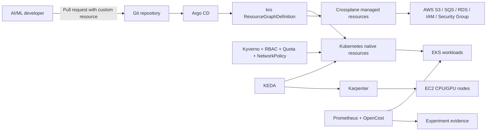

# Zero D-Rift Architecture Memory

This file is a navigational architecture map for agents. It is not a second
scope SSOT. When it disagrees with ver3, ver3 wins and this file must be corrected.

## Current repository state

As of project `/init`, no application, IaC, platform, workload, test-harness, or
experiment implementation has started. The repository contains the proposal
documents and the Eurus framework source.

## Planned repository boundaries

```text
Zero-D-Rift/
├── AGENTS.md
├── .agent/                     Project workflow and learning state
├── docs/                       Thesis, architecture, ADR-derived documents, runbooks
├── infrastructure/             Terraform/OpenTofu bootstrap and teardown
├── platform/                   Argo CD, Crossplane, kro and shared controllers
├── workloads/
│   ├── rag-sandbox/            RAG reference workload and blueprint instances
│   └── batch-training/         Event-driven batch/GPU reference workload
├── policies/                   Kyverno, RBAC, quota and network-policy resources
├── tests/                      Static, local and AWS integration checks
├── experiments/               Run manifests, raw data and analysis outputs
└── eurus-agent/                Reusable framework source; not a thesis deliverable
```

Directories are created only when an approved task needs them. This tree is a
boundary plan, not evidence that implementation exists.

## Planned control flow



## Responsibility boundaries

| Component | Owns | Does not own |
|---|---|---|
| Terraform/OpenTofu | VPC, EKS, OIDC and bootstrap IAM | Continuous workload reconciliation |
| Argo CD | Git desired-state synchronization | Direct AWS resource creation |
| kro | Golden-path API and resource dependency graph | AWS API calls by itself |
| Crossplane | AWS external resource provisioning/reconciliation | Full application delivery lifecycle |
| KEDA | Event-driven pod/job scaling | EC2 node provisioning |
| Karpenter | Node provisioning and reclamation | Training checkpoint persistence |
| OpenCost | Kubernetes allocation visibility | Authoritative final AWS invoice |
| IRSA | Temporary scoped AWS identity for a ServiceAccount | Kubernetes network isolation |

## Architectural invariants

1. One AWS account sandbox, one Region, and one EKS cluster for the PoC.
2. At most two simulated tenants; this is soft/logical isolation, not hostile
   tenant hard isolation.
3. Exactly two golden paths: `RAGSandbox` and `BatchTrainingJob`.
4. Shared pre-provisioned RDS for RAG; no RDS instance per sandbox.
5. A separate PoC database/clone is used for destructive recovery trials.
6. Terraform/OpenTofu bootstraps; Crossplane performs selected continuous
   reconciliation. The project does not claim one universally replaces the other.
7. Local-first development is allowed, but AWS-specific claims require EKS evidence.
8. No long-lived AWS access key may be stored in Git or injected into workload pods.
9. Cost, failure, and teardown evidence are first-class deliverables.

## Dependency order

```text
Architecture/cost/version decisions
  -> Terraform EKS bootstrap + teardown
  -> Argo CD
  -> Crossplane S3 vertical slice
  -> kro composition of the working slice
  -> RAGSandbox
  -> governance controls
  -> KEDA batch behavior
  -> Karpenter CPU, then GPU behavior
  -> cost instrumentation
  -> drift/recovery trials
  -> official experiment dataset
```

## P1 unresolved decisions

- Pinned EKS/Kubernetes and controller versions after compatibility research.
- AWS Region, network egress design, instance families and quota availability.
- Exact Crossplane AWS provider packages and management/deletion policies.
- Secrets Manager integration method for the bounded PoC.
- Local test environment (`kind` or `k3d`) and its known parity gaps.
- Exact baseline runbook and run-manifest schema.

Resolve each material decision in an ADR; do not silently update this file from
an agent assumption.

