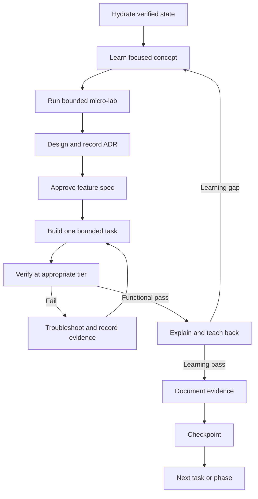

# Zero D-Rift Learning-Aware Delivery Workflow

## State machine

## Session start

1. Read root `AGENTS.md` and `.agent/workflows/active_context.md`.
2. Compare recorded Git state with `git rev-parse HEAD` and `git status --short`.
3. Read the active spec and only its linked ADRs/documents.
4. Report current phase, next unchecked subtask, blocker and expected evidence.
5. Do not provision AWS or mutate infrastructure during hydration.

## Work modes

| Mode | Use when | Agent behavior |
|---|---|---|
| Coach | Technology is new or concept is unclear | Explain, ask for prediction, guide one micro-lab, avoid full feature generation |
| Pair | Design is approved but implementation is still educational | Propose bounded diffs, explain choices, verify with owner |
| Executor | Work is repetitive and already understood | Perform approved mechanical changes and show evidence |

Mode escalation is `Coach -> Pair -> Executor`; do not jump to Executor for
Crossplane, kro, KEDA, Karpenter, IRSA, or recovery merely to save time.

## Feature loop

### Learn

- Define the problem, responsibility boundary, control/data flow, failure modes,
  alternatives and cost implications.
- Use official, pinned-version sources for AWS and cloud-native components.
- Learn only concepts required by the current phase.

### Micro-lab

- Prove one mechanism in isolation before composing it.
- Prefer local or low-cost environments when behavior does not require AWS.
- Record the observed result and the parity limitation of the lab.

### Design and spec

- Record material decisions as ADRs.
- Include learning objectives, acceptance/negative cases, cost impact, target files,
  evidence and teach-back questions.
- Owner approval is required before building a materially new feature.

### Build

- Implement one parent task or a small group of related subtasks.
- Preserve user changes and avoid unrelated refactoring.
- No scope expansion or new technology without an ADR and roadmap check.

### Verify

| Tier | Scope | Typical duration | Evidence |
|---|---|---:|---|
| L0 | formatting, YAML/schema, static policy | <30 s target | command and output |
| L1 | unit/render/local component | <2 min target | test/log artifact |
| L2 | kind/k3d integration | <10 min target | run ID and logs |
| L3 | AWS/EKS integration | 15–60 min expected | run manifest, AWS inventory and logs |
| L4 | official repeated experiment | scheduled campaign | immutable raw dataset and analysis |

Durations are planning targets, not pass/fail requirements. L3/L4 require an
explicit cost check and teardown plan.

### Explain

The owner should be able to explain:

1. Why the component exists.
2. What reconciles or calls what.
3. Where a permission/configuration failure appears.
4. Which evidence proves success.
5. What simpler alternative was rejected and why.

Record a learning gap honestly; do not block safe cleanup or urgent fixes merely
because a teach-back is incomplete.

## Troubleshooting and stopping conditions

- After a failure, preserve the core error, expected/actual state and last known
  working checkpoint.
- Retry only when a concrete hypothesis changed.
- After repeated identical failure, unexpected cost growth, destructive drift,
  or missing authority, stop and request owner direction.
- A fixed two-attempt rule is not appropriate for every infrastructure failure;
  risk and new evidence determine whether another attempt is justified.

## Checkpoint and Git policy

1. Run the relevant verification tier.
2. Update active context with observed state and evidence links.
3. Add durable lessons to cold memory only when they will matter in later phases.
4. Append a concise milestone to history only for meaningful state transitions.
5. Show changed files and Git status.
6. Commit or push only after explicit owner instruction; never run `git add .`.

