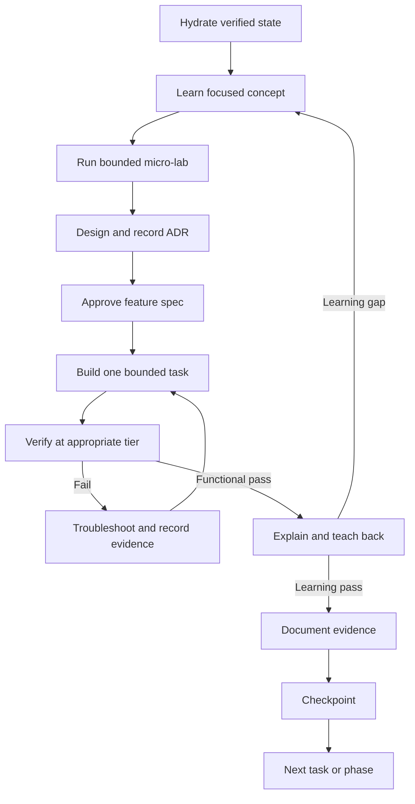

# Zero D-Rift Learning-Aware Delivery Workflow

## State machine

```mermaid
flowchart TD
    H[Hydrate verified state] --> L[Learn focused concept]
    L --> M[Run bounded micro-lab]
    M --> D[Design and record ADR]
    D --> S[Approve feature spec]
    S --> B[Build one bounded task]
    B --> V[Verify at appropriate tier]
    V -->|Fail| T[Troubleshoot and record evidence]
    T --> B
    V -->|Functional pass| E[Explain and teach back]
    E -->|Learning gap| L
    E -->|Learning pass| O[Document evidence]
    O --> C[Checkpoint]
    C --> N[Next task or phase]
```

## Context lifecycle

Context follows `Select -> Expand -> Work -> Verify -> Classify -> Contract`.
Use `.agent/references/context-governance.md` when starting/resuming a session or
writing a checkpoint. Active context is rewritten around the next decision; it
is not an append-only report of the session that just ended.

## Outcome gate

Before accepting a parent task, state its `outcome_trace`:

1. `RAGSandbox`, `BatchTrainingJob`, or a necessary cross-cutting condition;
2. the concrete end-user/system capability it advances;
3. the evidence that will show the capability became closer to usable;
4. why the work belongs in the MVP instead of the dojo or `COULD` backlog.

Do not close a task merely because documents, manifests, modules or controllers
exist. Close it only against the task acceptance evidence, while preserving the
difference between an enabling foundation, a local mechanism proof and an
end-to-end Golden Path outcome. Prefer the smallest walking skeleton toward the
first usable Golden Path over additional platform breadth.

## Session start

1. Read root `AGENTS.md` and `.agent/workflows/active_context.md`.
2. Query `git rev-parse HEAD` and `git status --short`; do not expect an embedded
   checkpoint hash to represent live state.
3. Read the referenced current learning status and classify intent/risk.
4. Load the active task, acceptance/negative cases and only the linked decisions
   needed for the request. Expand to the full spec for phase-wide or L3/L4 work.
5. Report current phase/task, verified state, blocker, next safe action, expected
   evidence and authority boundary.
6. Do not provision AWS or mutate infrastructure during hydration.

## Work modes

| Mode | Use when | Agent behavior |
|---|---|---|
| Coach | Technology is new or concept is unclear | Explain, ask for prediction, guide one micro-lab, avoid full feature generation |
| Pair | Design is approved but implementation is still educational | Propose bounded diffs, explain choices, verify with owner |
| Executor | Work is repetitive and already understood | Perform approved mechanical changes and show evidence |

Mode escalation is `Coach -> Pair -> Executor`; do not jump to Executor for
Crossplane, kro, KEDA, Karpenter, IRSA, or recovery merely to save time.

## Feature loop

### Learn

- Define the problem, responsibility boundary, control/data flow, failure modes,
  alternatives and cost implications.
- Use official, pinned-version sources for AWS and cloud-native components.
- Learn only concepts required by the current phase.

### Micro-lab

- Prove one mechanism in isolation before composing it.
- Prefer local or low-cost environments when behavior does not require AWS.
- Record the observed result and the parity limitation of the lab.

### Design and spec

- Record material decisions as ADRs.
- Include learning objectives, acceptance/negative cases, cost impact, target files,
  evidence and teach-back questions.
- Include the task's Golden Path or cross-cutting `outcome_trace` and the end-user
  benefit it enables; move work with no defensible trace outside the MVP.
- Owner approval is required before building a materially new feature.

### Build

- Implement one parent task or a small group of related subtasks.
- Preserve user changes and avoid unrelated refactoring.
- No scope expansion or new technology without an ADR and roadmap check.
- Prefer completing the bounded task end-to-end over pausing for reversible,
  low-risk micro-decisions already covered by the approved contract.

### Verify

| Tier | Scope | Typical duration | Evidence |
|---|---|---:|---|
| L0 | formatting, YAML/schema, static policy | <30 s target | command and output |
| L1 | unit/render/local component | <2 min target | test/log artifact |
| L2 | kind/k3d integration | <10 min target | run ID and logs |
| L3 | AWS/EKS integration | 15–60 min expected | run manifest, AWS inventory and logs |
| L4 | official repeated experiment | scheduled campaign | immutable raw dataset and analysis |

Durations are planning targets, not pass/fail requirements. L3/L4 require an
explicit cost check and teardown plan.

### Explain

The owner should be able to explain:

1. Which Golden Path/end-user outcome the component advances and why it exists.
2. What reconciles or calls what.
3. Where a permission/configuration failure appears.
4. Which evidence proves success.
5. What simpler alternative was rejected and why.

Record a learning gap honestly; do not block safe cleanup or urgent fixes merely
because a teach-back is incomplete.

## Troubleshooting and stopping conditions

- After a failure, preserve the core error, expected/actual state, reproduction
  conditions, recent relevant changes and last known working checkpoint.
- Locate the first failing component boundary. Compare redacted input, output,
  configuration and state at that boundary; never log credentials or secrets to
  gain observability.
- State one concrete root-cause hypothesis and test it with the smallest safe
  change or read-only probe. Do not bundle speculative fixes or unrelated refactors.
- Retry only when the hypothesis, evidence or relevant state changed.
- After repeated identical failure, unexpected cost growth, destructive drift,
  or missing authority, stop and request owner direction.
- A fixed two-attempt rule is not appropriate for every infrastructure failure;
  risk and new evidence determine whether another attempt is justified.

## Checkpoint and Git policy

1. Run the relevant verification tier and query live Git/external state.
2. Classify new information: active, durable decision, evidence, learning,
   milestone history or disposable detail.
3. Rewrite active context around the next safe action; do not paste chronology or
   duplicate whole sections from a SPEC/ADR/evidence file.
4. Update current learning status only from demonstrated evidence; append detailed
   learning history only for a meaningful new result.
5. Add durable lessons to cold memory only when they will matter in later phases;
   append history only for meaningful state transitions.
6. Run `.agent/scripts/check-context.ps1`, then show changed files and live Git status.
7. Commit or push only after explicit owner instruction; never run `git add .`.

