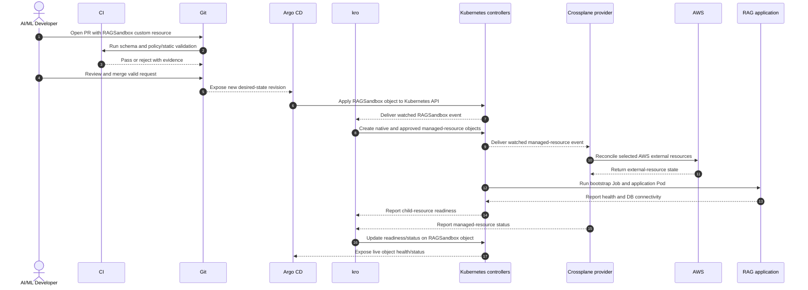

# System Design — Zero D-Rift

## 1. Mục đích và phạm vi

- PoC này giúp AI/ML developer tự phục vụ hạ tầng theo hai mẫu hạ tầng AI đã chuẩn hóa, đồng thời hỗ trợ quản trị phân quyền, quan sát chi phí, thu hồi tài nguyên nhàn rỗi, phát hiện sai lệch cấu hình và thực hiện quy trình phục hồi dữ liệu có kiểm soát.
- Hai golden path
  - `RAGSandbox`: môi trường ứng dụng RAG dùng EKS Pod, S3 và RDS PostgreSQL/pgvector dùng chung.
  - `BatchTrainingJob`: workload training theo batch, có khả năng yêu cầu GPU node động và lưu checkpoint vào S3.
- Giới hạn rõ ràng:
  - Một AWS account sandbox.
  - Một AWS Region.
  - Một EKS cluster.
  - Tối đa hai tenant mô phỏng.

## 2. Nguyên tắc kiến trúc

- Git là desired state
- Bootstrap plane tách khỏi platform control plane
- Không dùng AWS access key dài hạn trong pod
- Namespace tenancy là soft isolation, không phải hard isolation
- Những gì chưa kiểm chứng phải ghi `UNVERIFIED`

## 3. Những thành phần và ranh giới trách nhiệm

| Thành phần | Trách nhiệm chính | Input/Output | Không chịu trách nhiệm | Lý do có mặt |
| --- | --- | --- | --- | --- |
| Terraform/OpenTofu | Tạo bootstrap infrastructure: VPC, EKS, OIDC provider, system node group, IAM nền, logging và budget controls. | Nhận IaC configuration; tạo và lưu trạng thái các resource bootstrap. | Không liên tục reconcile resource của từng golden path. | Làm cho EKS và các điều kiện AWS nền tồn tại trước khi platform controller chạy. |
| Amazon EKS | Cung cấp Kubernetes control plane được AWS quản lý; worker node chạy controller và workload Pod. | Kubernetes API nhận manifest; scheduler/controller cập nhật trạng thái workload. | Không đồng bộ Git và không tự diễn giải Crossplane managed resource thành AWS API call. | Là runtime chung cho GitOps, platform controller và workload. |
| Argo CD | Theo dõi Git và đồng bộ desired-state manifest vào EKS. | Nhận Git revision/manifest; tạo hoặc cập nhật Kubernetes object và sync status. | Không trực tiếp gọi AWS API để tạo S3, RDS hoặc IAM. | Biến thay đổi đã merge trong Git thành desired state trong cluster. |
| kro | Cung cấp API cho hai golden path và tạo dependency graph giữa các Kubernetes object. | Nhận custom resource; sinh native resource/managed-resource manifest và tổng hợp readiness/status. | Không trực tiếp provision AWS resource, không thay Argo CD theo dõi Git và không thay controller của resource con. | Che giấu độ phức tạp sau hai API self-service có dependency và status rõ ràng. |
| Crossplane | Reconcile các AWS external resource đã được chọn từ desired state của managed resource. | Nhận managed-resource manifest, provider configuration và identity; phản ánh external-resource status về Kubernetes. | Không quản lý toàn bộ application lifecycle, Git sync hoặc dependency graph của golden path. | Cung cấp continuous reconciliation, gồm cơ chế cần cho thí nghiệm Security Group remediation. |
| Kubernetes workload | Chạy RAG application hoặc batch-training Job; thực hiện health check, DB access và checkpoint. | Nhận Deployment/Job, config, ServiceAccount và secret reference; trả về Pod/Job status, readiness và artifact/checkpoint. | Không tự cấp EC2 node, không giữ AWS admin credential và không tự tạo RDS instance. | Là workload mà golden path cấp phát và là đối tượng được kiểm chứng. |
| IRSA | Ánh xạ Kubernetes ServiceAccount identity sang IAM role để Pod nhận temporary AWS credentials. | Nhận projected ServiceAccount token, OIDC trust và IAM role mapping; AWS STS trả temporary credentials. | Không cấp quyền PostgreSQL, không quản lý Kubernetes RBAC/NetworkPolicy và không lưu secret. | Tránh AWS access key dài hạn trong Pod và giới hạn quyền AWS theo workload. |
| RDS PostgreSQL/pgvector | Cung cấp shared database đã chuẩn bị trước cho `RAGSandbox`; lưu dữ liệu quan hệ/vector trong phạm vi PoC. | Nhận kết nối từ application/bootstrap Job; cung cấp database hoặc schema và DB role riêng cho từng sandbox. | Không tạo instance mới cho từng `RAGSandbox`; không dùng DB chính cho destructive recovery trial. | Loại thời gian tạo RDS khỏi provisioning path và giữ một data service dùng chung có kiểm soát. |
| S3 | Lưu object, artifact/checkpoint và dữ liệu workload được cho phép. | Nhận AWS API call đã xác thực; cung cấp bucket/prefix và object theo policy. | Không thay RDS, không schedule Job và không thu hồi GPU node. | Giữ artifact/checkpoint bền vững khi Pod hoặc Spot node biến mất. |
| KEDA | Điều chỉnh số lần chạy Job theo event, ví dụ message trong SQS, thông qua `ScaledJob`. | Nhận scaler configuration và queue/event state; tạo Job theo nhu cầu. | Không provision EC2 node cho Pod đang pending. | Cung cấp event-driven execution và scale-to-zero cho `BatchTrainingJob`. |
| Karpenter | Provision, chọn capacity type và thu hồi EC2 node phù hợp với Pod constraints, gồm GPU. | Nhận tín hiệu Pod chưa schedule cùng NodePool/NodeClass constraints; tạo node và thực hiện disruption/reclamation. | Không scale Job theo SQS, không bảo đảm Spot capacity và không lưu checkpoint. | Chứng minh GPU node lifecycle và thử nghiệm Spot/On-Demand fallback. |
| Kyverno / RBAC / ResourceQuota / NetworkPolicy | Áp guardrail về admission, quyền Kubernetes, giới hạn tài nguyên và traffic giữa tenant. | Nhận policy/RBAC/quota/network rules; cho phép hoặc từ chối request và traffic tương ứng. | Không tạo hard multi-tenancy tương đương account/cluster riêng và không tự cấp AWS IAM permission. | Giới hạn hai tenant PoC và làm cơ sở cho negative security tests. |
| Prometheus / OpenCost | Thu metrics, utilization và allocation-cost view theo workload/namespace. | Nhận metrics và cost configuration; cung cấp time series và cost allocation. | Không phải hóa đơn AWS cuối cùng, không tự giảm chi phí và không terminate resource. | Hỗ trợ phân tích workload; dữ liệu billing AWS được dùng để đối soát chi phí thực tế. |

## 4. Hai plane và dependency order

### 4.1. Bootstrap plane

- Terraform/OpenTofu tạo VPC, EKS, OIDC provider, system node group, IAM nền, logging cơ bản và budget controls. Quyền sở hữu lifecycle của shared RDS và các S3 resource thuộc golden path phải được chốt bằng ADR; không mặc định chúng thuộc bootstrap plane.
- EKS cung cấp Kubernetes control plane được AWS quản lý. Kubernetes API nhận manifest; scheduler và controller quản lý desired state, còn Pod thực sự chạy trên worker node.
- OIDC provider cho phép AWS IAM xác minh projected ServiceAccount token do EKS phát hành, gồm đúng cluster issuer, namespace và ServiceAccount subject.
- Các platform controller chỉ có thể được cài sau khi EKS API và system nodes sẵn sàng, vì bản thân chúng là workload chạy trong cluster.

### 4.2. Platform control plane

- 3 thành phần Argo CD, kro, Crossplane kết nối với nhau như sau:
  Developer tạo PR chứa `RAGSandbox` YAML → merge → Argo CD đọc Git và apply YAML vào EKS → kro thấy một `RAGSandbox` mới và tạo các resource phụ thuộc → Crossplane thấy managed resource do kro tạo → Crossplane AWS provider
  gọi AWS API và reconcile các selected resource đã được phê duyệt → Crossplane cập nhật status vào Kubernetes → kro dùng status của các
  resource con để cập nhật readiness/status của RAGSandbox
- kro tạo Kubernetes object theo graph nhưng không thay thế controller của object đó: kro có thể tạo `Deployment`, nhưng Deployment controller mới tạo `ReplicaSet`/Pod; kro có thể tạo Crossplane managed resource, nhưng Crossplane provider mới gọi AWS API.
- Crossplane AWS Provider reconcile selected AWS external resource (S3, RDS, IAM, SG, SQS)

### 4.3. Thứ tự phụ thuộc

1. Hoàn tất các quyết định kiến trúc (ADR), version, cost và security của P1 trước khi triển khai để P2 không dùng version, network assumption hoặc Region chưa được ghi nhận.
2. Terraform tạo AWS Bootstrap VPC, EKS, OIDC Provider, system node group, base IAM, EKS phải tồn tại trước bất ký kubernetes controller hoặc workload nào có thể chạy
3. Cài và cấu hình Argo CD sau khi kubernetes API của EKS sẵn sàng. Argo CD trở thành cơ chế đồng bộ platform manifests và golden path instances từ git.
4. Cài Crossplane cùng AWS Provider package,ProviderConfig và Scope identity. Xác minh một S3 vertical slice trước: một Crossplane managed resource phải tạo, quan sát status và xoá được resource AWS tương ứng theo policy đã phê duyệt.
5. Cài kro sau khi Crossplane vertical slice ổn định. kro dùng Crossplane managed resource đã xác minh như một node trong ResourceGraphDefinition, thay vì đưa một dependency AWS chưa kiểm chứng vào golden path
6. Xây dựng và xác minh `RAGSandbox` end-to-end: namespace resources, ServiceAccount và IRSA, shared RDS access, S3 access, workload và readiness check.
7. Áp dụng governance control cho hai tenant mô phỏng: RBAC, ResourceQuota, NetworkPolicy, Pod Security và Kyverno. Chạy negative tests trước khi coi namespace tenancy là đủ cho phạm vi PoC.
8. Bổ sung BatchTrainingJob theo thứ tự KEDA trước, Karpenter CPU sau, rồi đến Karpenter GPU, workload phải checkpoint vào S3 trước khi dùng Spot/GPU lifecycle
9. Bổ sung Prometheus/Opencost và AWS cost reconciliation trước các thí nghiệm FinOps, drift và recovery. Thu raw evidence trước khi chạy offcial trials.
10. Chỉ bắt đầu official experiment collection khi version matrix, run manifest, baseline, timeout và exclusion rule đã được phê duyệt và đóng băng.

## 5. End-to-End request sequence

### 5.1 RAGSandbox

The sequence ends at status on the custom resource. Publishing that status back
to the pull-request interface requires a separate integration and remains
`UNVERIFIED`.

1. AI dev tạo PR chứa `RAGSandbox` custom resource theo schema golden path đã công bố
2. CI chạy schema validation, policy/static validation từ chối manifests không hợp lệ hoặc vượt qua tenant boundary.
3. Sau khi PR được review và merge. Argo CD phát hiện Git revision mới, sync `RAGSandbox` instance vào EKS và update sync status
4. kro watch `RAGSandbox`, tạo resource graph gồm namespace-scoped resources, ServiceAccount/IRSA binding, application Deployment, Service, database bootstrap Job/secret reference và các Crossplane managed resource đã được phê duyệt.
5. Kubernetes controller reconcile native resources thành Pod; Crossplane AWS provider reconcile selected AWS external resources như S3 theo desired state. Việc IAM/SG nào thuộc request path vẫn phải theo ADR đã phê duyệt. RDS PostgreSQL/pgvector là shared platform service đã được chuẩn bị trước, không tạo RDS instance mới cho mỗi request.
6. Database bootstrap Job dùng quyền database riêng để tạo logical database/schema/role; AWS IAM chỉ cấp quyền AWS cần thiết, ví dụ đọc secret được phép, chứ không thay thế PostgreSQL authorization.
7. `RAGSandbox` chỉ được công bố `Ready` khi resource graph đạt điều kiện readiness đã định nghĩa, application Pod healthy, ứng dụng kết nối database thành công và acceptance check tối thiểu hoàn tất trong timeout. Status được phản ánh trên custom resource; cách đưa status trở lại giao diện PR là `UNVERIFIED` nếu chưa chọn integration.

### 5.2. BatchTrainingJob

1. AI developer tạo PR chứa `BatchTrainingJob` custom resource theo schema golden path.
2. CI chạy schema validation, policy/static validation, sau khi merge Argo CD sync revision hợp lệ vào EKS
3. kro tạo resource graph cho batch workload, gồm `ScaledJob` và các resource cần thiết để KEDA quan sát event từ AWS SQS queue dùng chung trong phạm vi PoC.
4. KEDA theo dõi message/event và tạo Job theo cấu hình `ScaledJob`. Khi Job Pod yêu cầu GPU
   nhưng chưa schedule được, Karpenter provision node phù hợp theo NodePool và
   capacity constraints; ưu tiên Spot và dùng On-Demand fallback đã định nghĩa
   khi cần cho thí nghiệm.

5. Training container chạy workload, ghi checkpoint/artifact vào S3, hoàn thành
   Job và trả trạng thái thành công hoặc thất bại về Kubernetes.

6. KEDA ngừng tạo Job mới khi queue/event về 0. Sau khi Job hoàn thành và không còn Pod cần node, Karpenter có thể drain/terminate node theo disruption policy; checkpoint phải được xác minh trong S3 trước khi node bị thu hồi.

## 6. Identity, secret và trust boundary

### 6.1. IRSA identity flow

1. Terraform/OpenTofu tạo EKS OIDC provider và IAM roles nền.
2. Mỗi Pod workload sử dụng một Kubernetes ServiceAccount riêng.
3. ServiceAccount được liên kết với một IAM role tối thiểu qua IRSA annotation.
4. Pod nhận projected ServiceAccount token; AWS STS xác minh token qua EKS OIDC
   issuer và trust policy.
5. AWS STS cấp temporary credentials cho IAM role tương ứng; Pod không chứa
   long-lived AWS access key.

### 6.2. ServiceAccount và IAM role boundary

| Kubernetes ServiceAccount                 | IAM role scope                  | Được phép                                                          | Không được phép                                            |
| ----------------------------------------- | ------------------------------- | ------------------------------------------------------------------ | ---------------------------------------------------------- |
| Crossplane provider ServiceAccount        | Platform AWS provisioning role  | Reconcile selected AWS managed resources                           | Là runtime identity của tenant workload                    |
| `tenant-a` RAG application ServiceAccount | Tenant A workload IAM role      | Truy cập S3/AWS resource của Tenant A trong phạm vi cần thiết      | Truy cập resource Tenant B hoặc AWS admin API              |
| `tenant-b` RAG application ServiceAccount | Tenant B workload IAM role      | Truy cập S3/AWS resource của Tenant B trong phạm vi cần thiết      | Truy cập resource Tenant A hoặc AWS admin API              |
| Database bootstrap Job ServiceAccount     | Bounded AWS secret-access role  | Đọc đúng database bootstrap secret nếu integration yêu cầu         | Tự cấp quyền PostgreSQL chỉ bằng IAM hoặc đưa admin credential cho application Pod |
| Batch training ServiceAccount             | Batch artifact/checkpoint role  | Ghi checkpoint/artifact vào S3 scope được cấp                      | Truy cập secret hoặc data của tenant khác                  |

Exact IAM action, resource ARN và provider package: `UNVERIFIED` cho đến compatibility
spike và AWS account/Region review.

Quyền IAM và quyền PostgreSQL là hai lớp khác nhau. IRSA/STS chỉ quyết định Pod
được gọi AWS API nào; database/schema privilege do PostgreSQL role và credential
được cấp riêng quyết định.

### 6.3. Secret handling rules

- AWS Secrets Manager lưu database connection secret và các secret AWS-side cần thiết.
- Kubernetes chỉ nhận secret reference hoặc cơ chế đồng bộ đã được phê duyệt;
  phương pháp integration cụ thể: `UNVERIFIED`.
- Không commit secret value, access key, password, token, kubeconfig, `.tfstate`
  chứa secret, database connection string thật hoặc AWS account identifier.
- Log, screenshot, run manifest và experiment data phải redact token, password,
  endpoint riêng tư và thông tin nhận dạng account.
- Application workload không nhận administrative database credential.

### 6.4. Tenant trust boundary

- Tenant A và Tenant B sử dụng namespace, ServiceAccount, Role/RoleBinding,
  ResourceQuota và NetworkPolicy riêng.
- RBAC ngăn tenant đọc Kubernetes Secret hoặc object riêng của tenant còn lại.
- IAM role của tenant chỉ cho phép AWS resource/prefix thuộc tenant đó.
- Default-deny NetworkPolicy được áp dụng trước, sau đó chỉ mở traffic cần thiết.
- Kyverno/Pod Security chặn manifest vi phạm guardrail đã công bố.

### 6.5. Namespace tenancy limitation

Namespace-based tenancy là soft/logical isolation cho PoC. Nó không tương đương
AWS account, VPC, Kubernetes cluster hoặc hard isolation chống hostile tenant.
Shared control plane, node, network configuration và các lỗi cấu hình policy vẫn
là trust boundary cần được ghi nhận.

## 7. Data, recovery và teardown

### 7.1. Shared RDS design

- RDS PostgreSQL/pgvector là shared platform service được provision trước.
- Mỗi `RAGSandbox` nhận logical database hoặc schema và database role riêng trong
  giới hạn PoC.
- Database bootstrap Job có quyền giới hạn để tạo logical database/schema/role;
  application workload chỉ dùng credential scoped của chính sandbox.
- Một `RAGSandbox` không tạo RDS instance mới trong provisioning path.

### 7.2. Controlled data recovery boundary

- Data recovery dùng RDS PostgreSQL PoC riêng hoặc DB clone riêng.
- Không chạy destructive recovery experiment trên RDS shared phục vụ RAGSandbox.
- Trước trial phải xác minh manual snapshot hoặc retained backup tồn tại.
- Recovery success chỉ được ghi nhận khi data-integrity check pass và application
  reconnect thành công.
- Endpoint/secret update, retry/reconnect và approval step phải được ghi trong
  recovery runbook.

### 7.3. Pre-teardown resource inventory

- EKS cluster, managed node groups và Karpenter-provisioned EC2 nodes.
- VPC, subnet, route table, Internet Gateway, NAT Gateway, VPC endpoint,
  Elastic IP/public IPv4, ENI và load balancer.
- RDS instances, storage, manual snapshots, automated backups và parameter groups.
- S3 buckets, objects, versions và lifecycle configuration.
- SQS queues, CloudWatch log groups và retained log data.
- Security Groups, IAM roles/policies/instance profiles và OIDC provider.
- EBS volume, snapshot và Kubernetes persistent storage còn được retain.
- Budget alerts, TTL tags, owner tags và deletion/retain decision.

### 7.4. Cost after Pod scale-to-zero

Pod scale-to-zero không đồng nghĩa toàn bộ PoC hết chi phí. Các cost category cần
theo dõi riêng gồm EKS cluster fixed cost, system nodes, RDS instance/storage/
snapshot, S3 storage/request, NAT Gateway hoặc VPC endpoint, public IPv4,
CloudWatch logs, data transfer, retained EBS volume/snapshot và resource còn lại
sau Karpenter reclaim node.

## 8. Unresolved decisions

| Quyết định                                 | Trạng thái | Cách xác minh                                                                                                                                            | Không được giả định                                                                        |
| ------------------------------------------ | ---------- | -------------------------------------------------------------------------------------------------------------------------------------------------------- | ------------------------------------------------------------------------------------------ |
| AWS Region                                 | UNVERIFIED | Kiểm tra AWS service availability, GPU capacity/quota, giá, credit applicability và network requirement của account sandbox.                             | Không tự chọn Region chỉ vì phổ biến hoặc gần địa lý.                                      |
| Network egress design                      | UNVERIFIED | So sánh yêu cầu outbound của EKS/node/workload với chi phí và security trade-off của public subnet, NAT Gateway và VPC endpoint.                         | Không mặc định private subnet cần NAT Gateway hoặc public subnet là đủ an toàn.            |
| Local-first environment: `kind` hoặc `k3d` | UNVERIFIED | Thực hiện compatibility review/micro-lab cho Kubernetes workflow, controller install, ingress/network và local image workflow.                           | Không coi local environment tương đương EKS về IRSA, VPC CNI, Karpenter, RDS hoặc AWS IAM. |
| Crossplane AWS provider packages           | UNVERIFIED | Kiểm tra official compatibility documentation, supported Kubernetes/Crossplane versions, CRD footprint, ProviderConfig và managed-resource requirements. | Không cài toàn bộ AWS provider family hoặc pin package/version khi chưa có evidence.       |
| Secret integration method                  | UNVERIFIED | Đánh giá cách workload lấy secret từ AWS Secrets Manager, quyền IRSA cần thiết, secret rotation và redaction requirements.                               | Không mặc định dùng một controller/integration cụ thể hoặc đưa secret value vào Git.       |
| Exact IAM action/resource scope            | UNVERIFIED | Xác định từ selected AWS resources, tenant boundary và negative-access test plan.                                                                        | Không dùng wildcard administrative policy cho workload hoặc tenant.                        |
| Crossplane management/deletion policies    | UNVERIFIED | Kiểm tra semantics theo version Crossplane/provider đã pin và thiết kế teardown/recovery requirement.                                                    | Không dùng policy/value chỉ dựa trên ví dụ cũ hoặc giả định resource sẽ tự retain/delete.  |

Các quyết định trên không được đóng trước compatibility spike, account/quota review
và evidence chính thức. Khi chưa xác minh, mọi tài liệu liên quan phải giữ nhãn
`UNVERIFIED`.

## 9. ADRs cần tạo hoặc quyết định sau

### 9.1. ADR cần ghi nhận trong P1

| ADR đề xuất                                        | Trạng thái hiện tại | Decision boundary                                                                           | Evidence bắt buộc trước khi chốt                                                            |
| -------------------------------------------------- | ------------------- | ------------------------------------------------------------------------------------------- | ------------------------------------------------------------------------------------------- |
| Shared RDS và separate recovery database           | READY TO RECORD     | RAGSandbox dùng shared pre-provisioned RDS; destructive recovery dùng RDS/clone PoC riêng.  | Canonical scope ver3 và threat/recovery boundary review.                                    |
| Bootstrap plane và platform control plane boundary | READY TO RECORD     | Terraform/OpenTofu bootstrap AWS/EKS; Argo CD, kro và Crossplane chạy sau khi EKS sẵn sàng. | Canonical scope ver3, system design và dependency review.                                   |
| Local-first environment: `kind` hoặc `k3d`         | DECISION PENDING    | Chọn một local environment cho development trước EKS.                                       | Compatibility micro-lab, documented parity gaps và owner review.                            |
| Selected Crossplane AWS provider packages          | DECISION PENDING    | Chỉ chọn package/service cần cho S3, IAM, Security Group, RDS và khi cần SQS.               | Official compatibility evidence, version matrix và CRD footprint review.                    |
| AWS Region và network egress design                | DECISION PENDING    | Chọn Region và egress architecture trong giới hạn cost/security PoC.                        | Account credit/quota evidence, service availability và cost comparison.                     |
| Secret integration method                          | DECISION PENDING    | Chọn cách workload tham chiếu/lấy secret từ AWS Secrets Manager.                            | IAM boundary, redaction requirement, compatibility evidence và local/EKS parity assessment. |
| Crossplane management/deletion policy              | DECISION PENDING    | Xác định lifecycle của selected AWS resources khi manifest bị đổi/xóa.                      | Pinned version semantics, teardown plan và recovery safety review.                          |

### 9.2. Quy tắc tạo ADR

- ADR chỉ ghi một quyết định material, lý do, alternatives, consequences và evidence.
- ADR không được mở rộng hai golden path, một-account/một-Region boundary hoặc
  các negative boundary của P1.
- Quyết định chưa có official compatibility evidence, account evidence hoặc owner
  review phải giữ `DECISION PENDING`/`UNVERIFIED`.
- Version, cost, quota và service availability không được ghi là kết quả đã xác
  minh nếu chưa có source link, check date và evidence path.
