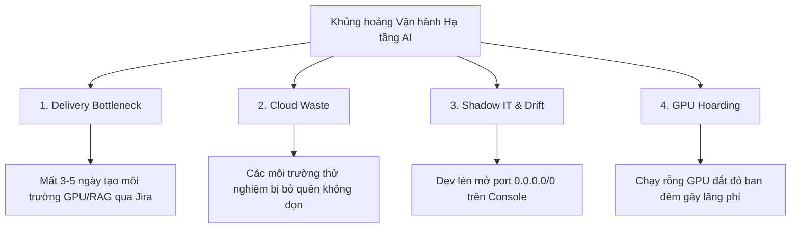
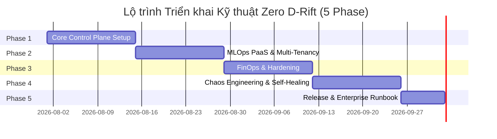

# BẢN ĐẶC TẢ DỰ ÁN & ĐỀ CƯƠNG BÁO CÁO TỐT NGHIỆP (PHIÊN BẢN HỢP NHẤT DRIFT2)
## Zero D-Rift: Enterprise MLOps & IDP Platform on AWS

---

### 📋 TRUY XUẤT THÔNG TIN HÀNH CHÍNH & ĐỀ TÀI

| Hạng mục | Thông tin chi tiết |
| :--- | :--- |
| **Trường / Viện** | Trường Đại Học Thủ Dầu Một — Viện Công Nghệ Số |
| **Tên đề tài đăng ký** | **Nghiên cứu và xây dựng nền tảng Internal Developer Platform hỗ trợ cấp phát và quản trị hạ tầng ứng dụng AI trên AWS** |
| **Tên thương mại / Codename** | **Zero D-Rift** (Enterprise MLOps & IDP Platform) |
| **Sinh viên thực hiện** | Lê Văn Hoàng — MSSV: `2224802010279` |
| **Lớp / Khóa** | D22CNTT02 — Khóa 2022–2027 |
| **Số điện thoại** | 0399354603 |
| **Giảng viên hướng dẫn** | ThS. Nguyễn Trung Kiệt |
| **Thời gian & Địa điểm** | TP. Hồ Chí Minh, ngày 20 tháng 07 năm 2026 |

---

## 📑 MỤC LỤC

1. [Phần I: Đề Cương Nghiên Cứu & Báo Cáo Tốt Nghiệp](#phần-i-đề-cương-nghiên-cứu--báo-cáo-tốt-nghiệp)
   - [1.1. Mục tiêu nghiên cứu](#11-mục-tiêu-nghiên-cứu)
   - [1.2. Nội dung & Phạm vi nghiên cứu (MVP Scope)](#12-nội-dung--phạm-vi-nghiên-cứu-mvp-scope)
   - [1.3. Phương pháp nghiên cứu & Phân định Công nghệ](#13-phương-pháp-nghiên-cứu--phân-định-công-nghệ)
   - [1.4. Sản phẩm dự kiến bàn giao (Deliverables)](#14-sản-phẩm-dự-kiến-bàn-giao-deliverables)
2. [Phần II: Bản Đặc Tả Kỹ Thuật Dự Án (Technical Specification)](#phần-ii-bản-đặc-tả-kỹ-thuật-dự-án-technical-specification)
   - [2.1. Bối cảnh & 4 Cuộc khủng hoảng vận hành (Enterprise Pain Points)](#21-bối-cảnh--4-cuộc-khủng-hoảng-vận-hành-enterprise-pain-points)
   - [2.2. Mục tiêu kiến trúc & 4 Trụ cột Kỹ thuật Lõi](#22-mục-tiêu-kiến-trúc--4-trụ-cột-kỹ-thuật-lõi)
   - [2.3. Danh mục Công nghệ Triển khai (Technology Stack Matrix)](#23-danh-mục-công-nghệ-triển-khai-technology-stack-matrix)
   - [2.4. Bảng Chỉ số Đo lường Kỹ thuật Định lượng & Baseline](#24-bảng-chỉ-số-đo-lường-kỹ-thuật-định-lượng--baseline)
3. [Phần III: Quản Trị Ngân Sách & Lộ Trình Triển Khai](#phần-iii-quản-trị-ngân-sách--lộ-trình-triển-khai)
   - [3.1. Chiến lược Kiểm soát Ngân sách AWS ($100 Limit) & Script Teardown 1-Click](#31-chiến-lược-kiểm-soát-ngân-sách-aws-100-limit--script-teardown-1-click)
   - [3.2. Lộ trình Triển khai Kỹ thuật (SDLC Roadmap 5 Phase)](#32-lộ-trình-triển-khai-kỹ-thuật-sdlc-roadmap-5-phase)
4. [Phần IV: Tiêu Chuẩn Nghiệm Thu & Live Demo Scenarios](#phần-iv-tiêu-chuẩn-nghiệm-thu--live-demo-scenarios)
   - [4.1. Kịch bản Live Demo trực tiếp](#41-kịch-bản-live-demo-trực-tiếp)
   - [4.2. Phương án Demo Dự phòng (Fallback Plan)](#42-phương-án-demo-dự-phòng-fallback-plan)

---

# PHẦN I: ĐỀ CƯƠNG NGHIÊN CỨU & Báo Cáo TỐT NGHIỆP

### 1.1. Mục tiêu nghiên cứu

* **Quản trị tập trung (Control Plane):** Thiết kế nền tảng Control Plane hạ tầng tập trung nhằm thay thế các quy trình cấp phát tài nguyên điện toán đám mây thủ công truyền thống (như gửi Ticket Jira, viết script rải rác).
* **Cấp phát siêu tốc (Zero-Touch Provisioning):** Tối ưu hóa thời gian khởi tạo môi trường phát triển, rút ngắn thời gian cung cấp các cụm hạ tầng AI phức tạp (RAG Sandbox, Batch Training) từ vài ngày (3–5 ngày) xuống dưới **5 phút**.
* **Quản trị chi phí động (Dynamic FinOps):** Xây dựng cơ chế tự động theo dõi và thu hồi tài nguyên nhàn rỗi (Scale-to-Zero cho Dev, Karpenter Spot Orchestration cho Prod) và điều phối Node GPU thông minh, triệt tiêu lãng phí ngân sách Cloud.
* **Chống sai lệch & Tự phục hồi Kép (SecOps Auto-Remediation & Stateful Healing):** Đảm bảo an toàn dữ liệu và tính sẵn sàng của hệ thống thông qua 2 cơ chế độc lập:
  * **SecOps Auto-Remediation:** Tự động đối soát cấu hình 24/7 (Anti-drift) và đè lại quy tắc bảo mật (Security Group) rò rỉ trong **< 60 giây**.
  * **Stateful Data Recovery:** Tự phục hồi cơ sở dữ liệu từ bản RDS Automated Snapshot gần nhất và tiêm Endpoint mới vào AWS Secrets Manager khi gặp sự cố xóa nhầm.

---

### 1.2. Nội dung & Phạm vi nghiên cứu (MVP Scope)

#### A. Nội dung nghiên cứu
1. Khảo sát mô hình **Platform Engineering** và các vấn đề thực tiễn (Pain points) trong vận hành hạ tầng AI tại doanh nghiệp (*Delivery Bottleneck, Cloud Waste, Shadow IT & Configuration Drift, GPU Hoarding*).
2. Thiết kế kiến trúc hệ thống đa người dùng (**Multi-Tenancy**) và phân quyền bảo mật tối giản thông qua luồng IAM IRSA (*IAM Roles for Service Accounts*) gắn động theo từng Namespace.
3. Phát triển các mẫu cấp phát tài nguyên tự động (**02 Golden Path API Blueprints**) bằng việc kết hợp Kubernetes, Crossplane và `kro`.
4. Tích hợp các giải pháp Autoscaling chuyên sâu cho AI Workloads (**KEDA**, **Karpenter Spot Orchestration**) và công cụ giám sát chi phí (**OpenCost**).
5. Thiết lập kịch bản kiểm thử độ bền & bảo mật (**Chaos & SecOps Engineering**) để đánh giá khả năng tự khôi phục cấu hình bảo mật và phục hồi cơ sở dữ liệu trên Cloud.

#### B. Phạm vi nghiên cứu (Khoanh vùng ranh giới MVP)
* **Nền tảng Cloud:** Hệ thống lõi được triển khai trên `01` cụm **Amazon EKS (Elastic Kubernetes Service)** cho PoC (không xây dựng production-grade multi-region phức tạp).
* **Đối tượng Người dùng cuối (Internal Developer Experience):** ML Engineers / AI Developers thao tác tự phục vụ thông qua **GitOps Workflow** (gửi declarative YAML manifest vào Git Repository), không cần truy cập trực tiếp vào AWS Console.
* **Khoanh vùng 02 Golden Paths (Blueprint):**
  1. **RAG Sandbox Blueprint:** Tự động cấp phát môi trường RAG hoàn chỉnh (Amazon EKS App Pod + AWS S3 Bucket + AWS RDS PostgreSQL với extension `pgvector`). *(Loại bỏ dịch vụ OpenSearch Serverless để tối ưu ngân sách thử nghiệm)*.
  2. **Batch Training Sandbox Blueprint:** Tự động cấp phát môi trường huấn luyện mô hình nhàn rỗi (EKS GPU Node điều phối bởi Karpenter Spot Orchestration + KEDA Scale-to-Zero).
* **Multi-tenancy:** Cô lập tối đa 02 Tenants được mô phỏng bằng Kubernetes Namespace, `ResourceQuota`, `NetworkPolicies` và IAM IRSA.

---

### 1.3. Phương pháp nghiên cứu & Phân định Công nghệ

#### A. Phương pháp nghiên cứu
* **Nghiên cứu lý thuyết:** Tổng hợp, phân tích tài liệu chuyên ngành về Cloud Native Architecture, Platform Engineering và mô hình FinOps.
* **Phương pháp thực nghiệm (Proof of Concept - PoC):** Xây dựng và cấu hình trực tiếp trên môi trường Kubernetes thực tế (Local `k3d`/`kind` trong giai đoạn phát triển và AWS EKS thực tế trong giai đoạn kiểm thử); thực hiện kiểm thử 20 lần đo lường cho mỗi kịch bản để thu thập số liệu thống kê.

#### B. Phân định Vai trò Công nghệ
* **Control Plane Core:** Kubernetes (`v1.30+`), ArgoCD (GitOps state management).
* **Resource Graph & Blueprints:** `kro` (AWS Controllers) — Sử dụng để định nghĩa cấu trúc đồ thị tài nguyên (Resource Graph Definition) và tạo Custom Resource Definitions (CRD).
* **Infrastructure Provisioning Engine:** `Crossplane` + `Crossplane Provider-AWS` — Trực tiếp thực thi API call để khởi tạo và đối soát (Reconciliation) tài nguyên thực tế trên AWS Cloud.
* **FinOps & Autoscaling:** Karpenter (`v1.0+`, Spot Instance Orchestration), KEDA (`v2.14+`, Pod Scale-to-Zero), OpenCost (Cost allocation metrics).
* **Security & Governance:** AWS IAM IRSA (Pod-level Zero-Trust), Kyverno (Policy-as-Code Webhook), AWS Secrets Manager, ExternalDNS.

---

### 1.4. Sản phẩm dự kiến bàn giao (Deliverables)

1. **Báo cáo chuyên sâu:** `01` Quyển báo cáo chi tiết về thiết kế, kiến trúc hệ thống và kết quả thực nghiệm của nền tảng IDP.
2. **Bộ mã nguồn IaC:** Toàn bộ Infrastructure-as-Code (Manifests, Blueprints, Kyverno Policies) được đóng gói chuẩn hóa trên GitHub repository kèm file `README.md` và script Teardown.
3. **Hệ thống thực nghiệm (PoC):** Cụm EKS hoạt động thực tế trên AWS, đáp ứng thành công 3 kịch bản kiểm thử: *Self-Service Provisioning*, *SecOps & Stateful Healing (Phá hoại kép)*, và *FinOps Auto-Recycling*.
4. **Bộ chỉ số & Dataset số liệu:** Tập hợp số liệu đo lường định lượng từ 20 lần cấp phát thực nghiệm (Provisioning Time, MTTR, Cost Saving Ratio).
5. **Bộ sản phẩm dự phòng (Fallback Package):** 
   * `01` Video Demo quay sẵn (Full HD) chi tiết toàn bộ 3 kịch bản.
   * Tập dữ liệu Log & Dashboard lưu trữ offline phòng sự cố gián đoạn mạng Cloud trong buổi bảo vệ.

---

# PHẦN II: BẢN ĐẶC TẢ KỸ THUẬT DỰ ÁN (TECHNICAL SPECIFICATION)

### 2.1. Bối cảnh & 4 Cuộc khủng hoảng vận hành (Enterprise Pain Points)

Sự bùng nổ của các mô hình ngôn ngữ lớn (LLM) và hệ thống Multi-Agent đang định hình lại quy trình làm việc của doanh nghiệp. Các đội ngũ AI liên tục thử nghiệm và triển khai mô hình mới. Tuy nhiên, quy trình vận hành hạ tầng truyền thống (Ticketing qua Jira + Terraform viết thủ công) tạo ra **4 cuộc khủng hoảng vận hành nghiêm trọng**:



1. **Khủng hoảng Tốc độ & Phân mảnh (Delivery Bottleneck):** Việc cấp phát môi trường huấn luyện GPU hay kiến trúc RAG thủ công mất từ 3 đến 5 ngày. Các đội dự án dùng chung tài nguyên gây xung đột và thiếu vách ngăn bảo mật.
2. **Khủng hoảng Lãng phí Tài nguyên (Cloud Waste):** Hàng loạt môi trường thử nghiệm AI bị bỏ quên không dọn dẹp sau khi dùng xong, gây thất thoát ngân sách hàng tháng.
3. **Lỗ hổng Bảo mật tự phát (Shadow IT & Configuration Drift):** Kỹ sư AI hoặc Dev lén can thiệp trực tiếp trên AWS Console (ví dụ: mở toang port `0.0.0.0/0` để tiện test code ở nhà) làm sai lệch cấu hình gốc. Terraform truyền thống "mù tịt" sau khi chạy xong, biến hệ thống thành con mồi cho Hacker.
4. **Thảm họa lãng phí GPU (GPU Hoarding):** Việc cấp máy GPU đắt đỏ (`g4dn`/`p3`) cho Dev nhưng họ quên tắt máy sau khi train xong mô hình (chạy rỗng qua đêm) gây thất thoát hàng ngàn USD, trong khi các team khác lại không có máy dùng.

---

### 2.2. Mục tiêu kiến trúc & 4 Trụ cột Kỹ thuật Lõi

Dự án chuyển đổi tư duy quản lý hạ tầng từ **"Pipeline tĩnh"** sang **"Control Plane động"**, xoay quanh 4 trụ cột kỹ thuật:

```
+-----------------------------------------------------------------------------------+
|                            ZERO D-RIFT CONTROL PLANE                              |
+---------------------+---------------------+---------------------+-----------------+
|   TRỤ CỘT 1         |   TRỤ CỘT 2         |   TRỤ CỘT 3         |   TRỤ CỘT 4     |
| Hard Isolation      | MLOps PaaS          | Dynamic FinOps      | Stateful Self-  |
| & Zero-Trust IRSA   | & Self-Service      | & Spot Autoscaling  | Healing & SecOps|
+---------------------+---------------------+---------------------+-----------------+
```

#### 🏛️ Trụ cột 1: Kiến trúc Đa người dùng & Phân quyền Tối giản (Hard Isolation & Least Privilege)
* **Namespace Isolation:** Tự động khởi tạo Namespace riêng biệt trên Kubernetes cho từng đội AI.
* **Traffic & Resource Limits:** Áp dụng `NetworkPolicies` cách ly luồng mạng và `ResourceQuotas` giới hạn dung lượng CPU/GPU tối đa.
* **Bảo mật Zero-Trust với IRSA:** Ứng dụng AI truy cập S3 hoặc Amazon Bedrock thông qua *IAM Roles for Service Accounts (IRSA)*. Quyền truy cập cấp phát động ở cấp độ Pod thay vì dùng Access Key tĩnh, triệt tiêu 100% rủi ro rò rỉ credential.

> [!IMPORTANT]
> **Zero-Trust với IRSA:** Tuyệt đối không lưu trữ `AWS_ACCESS_KEY_ID` hay `AWS_SECRET_ACCESS_KEY` trong mã nguồn hay Pod environment variables. Tất cả các Pod AI kết nối với AWS Bedrock/S3 thông qua Service Account token gắn IAM Role động.

#### 🚀 Trụ cột 2: Nền tảng MLOps Tự phục vụ (MLOps PaaS)
* **API Blueprints với `kro`:** Đóng gói hạ tầng phức tạp (S3 + RDS PostgreSQL/pgvector + App Pods) thành các API CRD nội bộ ngắn gọn (`RAGSandbox`, `BatchTrainingJob`).
* **Dynamic Node Provisioning với `Karpenter`:** Tự động gọi Node GPU khi bắt đầu công việc huấn luyện AI và thu hồi ngay lập tức khi kết thúc.
* **Single-YAML Delivery:** Dev cấp phát kết nối Amazon Bedrock và Vector Database siêu tốc chỉ bằng một lệnh declarative YAML gửi vào Git Repository.

#### 💰 Trụ cột 3: Quản trị Chi phí Động (Dynamic FinOps)
* **Tự động săn Spot Instance (Spot Orchestration):** `Karpenter` không chỉ scale node bình thường, mà được cấu hình để tự động "săn" các máy GPU Spot giá rẻ của AWS (tiết kiệm đến 70%).
* **Stateful Suspend & Thu hồi Node động:** Khi AI Job kết thúc hoặc nhàn rỗi quá 15 phút, `KEDA` và `Karpenter` tự động kích hoạt luồng *Graceful Drain* (lưu trạng thái đang chạy) và tiêu hủy Node GPU đó ngay lập tức để chặn đứng dòng tiền rò rỉ.
* **Chi tiết hóa chi phí:** Tích hợp `OpenCost` đo lường chi phí hạ tầng tới từng Pod/Namespace/Workflow.
* **Slack Approval Workflow:** Áp dụng vòng lặp duyệt tự động qua Slack/Teams trước khi gia hạn hoặc thu hồi môi trường thử nghiệm (TTL).
* **Tối ưu Scale thông minh với KEDA:**
  * **Môi trường Dev/Test:** Cấu hình **Scale-to-Zero** để triệt tiêu 100% chi phí khi không có lưu lượng truy cập.
  * **Môi trường Production/Độ trễ thấp:** Cấu hình `Min Replicas = 1` chạy trên **AWS Spot Instances** giá rẻ, giữ "warm pool" để triệt tiêu rủi ro *Cold Start* (mất 5–10 phút pull Image và khởi động GPU).

#### 🛡️ Trụ cột 4: Vòng lặp Đối soát & Chữa lành Hệ thống (Stateful Self-Healing & SecOps)
* **Tự động vá lỗi Bảo mật (Security Auto-Remediation):** `Crossplane` chạy vòng lặp đối soát (Reconciliation Loop) 24/7. Nếu phát hiện ai đó lén mở Port Public (`0.0.0.0/0`) hoặc đổi cấu hình mạng trái phép, hệ thống sẽ tự động đè lại cấu hình bảo mật chuẩn trong vòng **dưới 60 giây**, khóa chặt lỗ hổng mà không cần con người can thiệp.
* **24/7 Anti-Drift:** Sử dụng `Crossplane` liên tục đối soát trạng thái Cloud với Git 24/7. Nếu phát hiện thay đổi thủ công trên AWS Console, Crossplane tự động ghi đè về trạng thái khai báo gốc.
* **An toàn dữ liệu với `DeletionPolicy: Retain`:** Cấu hình chính sách giữ lại tài nguyên lõi (S3, RDS). Nếu file IaC bị xóa ngoài ý muốn, tài nguyên thực trên AWS không bị xóa theo.
* **Cập nhật Endpoint Động (Auto-Reconnect):** Khi khôi phục Database từ Snapshot, Crossplane tự động tiêm Endpoint mới vào **AWS Secrets Manager** (hoặc cập nhật qua **ExternalDNS**). Ứng dụng AI tự động kết nối lại Database mới dưới **2 phút** mà không cần sửa code hay can thiệp thủ công.

> [!TIP]
> **SecOps & Stateful Healing Workflow:** 
> `Mở lén Port 0.0.0.0/0 & Xóa Database trên AWS Console` ➔ `Crossplane phát hiện Configuration Drift & Missing Resource` ➔ `Tự động khóa Port (10.0.0.0/16) trong <60s, tái tạo DB từ Snapshot & tiêm Endpoint mới vào Secrets Manager` ➔ `App Pods tự động reconnect thành công & bắn alert Slack`.

---

### 2.3. Danh mục Công nghệ Triển khai (Technology Stack Matrix)

| Phân lớp (Layer) | Công nghệ / Dịch vụ | Vai trò & Trách nhiệm chính |
| :--- | :--- | :--- |
| **Cloud Infrastructure** | AWS (EKS, S3, RDS pgvector, Bedrock, Spot Instances) | Nền tảng điện toán đám mây và dịch vụ AI managed |
| **Resource Graph Definition** | `kro` (AWS Resource Orchestrator) | Định nghĩa đồ thị tài nguyên phức tạp thành Custom Resource Definition (CRD) |
| **Infrastructure Engine** | Crossplane & Crossplane Provider-AWS | Thực thi API call cấp phát và đối soát (Reconciliation Loop) 24/7 trên AWS |
| **Identity & Security** | AWS IAM IRSA, Kyverno, AWS Secrets Manager | Phân quyền Zero-Trust cấp Pod, Policy-as-Code và quản lý bí mật |
| **Autoscaling & FinOps** | Karpenter (Spot Orchestration), KEDA, OpenCost | Cấp phát GPU Node động, Săn máy Spot, Scale-to-Zero Pods và đo lường chi phí |
| **GitOps & Delivery** | ArgoCD, ExternalDNS | Đồng bộ trạng thái mong muốn từ Git và tự động điều phối bản ghi DNS |

---

### 2.4. Bảng Chỉ số Đo lường Kỹ thuật Định lượng & Baseline

Để đảm bảo tính khoa học và khả năng chứng minh kết quả trước Hội đồng, dự án thiết lập bộ chỉ số đo lường với mốc so sánh (Baseline) cụ thể:

| Nhóm chỉ số | Tên chỉ số (Metric) | Cách thức đo lường | Baseline (Quy trình Thủ công) | Mục tiêu Zero D-Rift (IDP PoC) |
| :--- | :--- | :--- | :--- | :--- |
| **Provisioning** | *Provisioning Time* | Thời gian từ khi gửi yêu cầu đến khi Ready | 3 – 5 ngày (Gửi Ticket Jira) | **< 5 phút** (Self-service GitOps) |
| **Automation** | *Manual Steps Reduced* | Số bước kỹ sư phải thao tác thủ công | 12 – 15 bước (Terraform & Console) | **01 lệnh Git commit** |
| **SecOps** | *Drift Remediation Time* | Thời gian từ khi bị rò rỉ Port đến khi vá lại | Không tự phát hiện (Cần Audit tay) | **< 60 giây** (Crossplane Loop) |
| **FinOps** | *Cost Saving Ratio* | Tỷ lệ tiết kiệm chi phí nhàn rỗi ban đêm | 0% (Node GPU chạy rỗng 24/7) | **Giảm 60% – 70%** (Scale-to-Zero/Spot) |
| **Reliability** | *Provisioning Success Rate* | (Số lần thành công / 20 lần thử nghiệm) | Phụ thuộc sai sót con người (~70%) | **≥ 95%** (Tự động hóa 100%) |
| **Recovery** | *MTTR (Data & Service)* | Thời gian khôi phục DB từ Snapshot & Reconnect | 2 – 4 giờ (Phục hồi thủ công) | **< 2 phút** (Dynamic Secrets Injection) |

---

# PHẦN III: QUẢN TRỊ NGÂN SÁCH & LỘ TRÌNH TRIỂN KHAI

### 3.1. Chiến lược Kiểm soát Ngân sách AWS ($100 Limit) & Script Teardown 1-Click

Để đảm bảo thực thi thành công trong phạm vi ngân sách $100 AWS Credit, dự án áp dụng chiến lược 4 tầng bảo vệ tài chính:

1. **Chiến lược Local-First (80/20):**
   * **80% Thời gian:** Toàn bộ công tác phát triển mã nguồn, viết YAML manifest, cấu hình `kro` Blueprint, Kyverno policy và KEDA scaler được thực hiện và kiểm thử trên cụm Kubernetes cục bộ (`k3d` / `kind`) hoàn toàn **miễn phí**.
   * **20% Thời gian:** Chỉ khởi tạo cụm AWS EKS thực tế trong các đợt chạy thực nghiệm đo lường chỉ số và quay video Live Demo.
2. **Quản trị Cảnh báo Chi phí (AWS Budget Alert):** Thiết lập Cảnh báo tự động bắn về Email/Slack ngay khi chi phí AWS đạt ngưỡng **$80**.
3. **Bắt buộc Gán Tag Tài nguyên (Resource Tagging):** Áp dụng Kyverno policy bắt buộc tất cả tài nguyên AWS khởi tạo phải chứa tag: `Project=Zero-D-Rift`, `Owner=HoangLV`, `Environment=PoC`.
4. **Script Teardown 1-Click:** Đóng gói script tự động dọn dẹp sạch sẽ toàn bộ EKS Cluster, S3 Buckets, RDS Instances và EKS Nodes ngay sau khi kết thúc đợt thử nghiệm:
   ```bash
   ./scripts/teardown-poc.sh --confirm-destroy
   ```

---

### 3.2. Lộ trình Triển khai Kỹ thuật (SDLC Roadmap 5 Phase)



| Giai đoạn (Phase) | Trọng tâm Kỹ thuật (Engineering Focus) | Kết quả đầu ra (Milestones) |
| :--- | :--- | :--- |
| **Phase 1: Core Control Plane** | Dựng cụm AWS EKS và thiết lập bộ não điều phối. Cấu hình Crossplane Provider kết nối AWS qua IAM IRSA bảo mật. Cài đặt `kro`. | Cụm Kubernetes quản lý thành công tài nguyên AWS (Tự động khởi tạo S3 Bucket từ khai báo YAML). |
| **Phase 2: MLOps PaaS & Multi-Tenant** | Viết YAML Blueprints cho RAG Sandbox & Batch Training Sandbox. Thiết lập IRSA, NetworkPolicies và ResourceQuotas cho các tenant. | Dev đẩy 1 file YAML vào Git ➔ IDP tự sinh cụm hạ tầng cô lập với quyền IAM Zero-Trust. |
| **Phase 3: FinOps & Hardening** | Tích hợp OpenCost & Karpenter Spot Orchestration. Thiết lập KEDA (Scale-to-Zero cho Dev, Spot Instances cho Prod). Viết Kyverno rule chặn tài nguyên thiếu mã hóa. Cấu hình Slack notification. | Hạ tầng AI tự động thu hồi GPU khi nhàn rỗi (Graceful Drain); quy tắc an toàn bảo mật được thực thi tự động 100%. |
| **Phase 4: Chaos & SecOps Testing** | Cấu hình `DeletionPolicy: Retain`. Thiết lập cơ chế tự động vá lỗi bảo mật (Security Group Drift) và xoay vòng Endpoint tự động qua AWS Secrets Manager & ExternalDNS. Giả lập thử nghiệm phá hoại kép (Mở Port `0.0.0.0/0` & Xóa RDS) trên Console. | **Báo cáo độ bền (Resilience Report):** Tự động khôi phục cấu hình bảo mật chuẩn <60s, phục hồi DB từ Snapshot và App AI tự reconnect dưới 2 phút. Thực hiện 20 lần đo thu thập số liệu. |
| **Phase 5: Release & Runbook** | Đóng băng kiến trúc. Viết tài liệu vận hành (Runbook) chuẩn doanh nghiệp: Hướng dẫn deploy, thêm API Blueprint, bảo trì, debug IDP và bộ sản phẩm dự phòng. | Đóng gói sản phẩm (Project Release), hoàn tất hồ sơ nghiệm thu trước Hội đồng Kiến trúc. |

---

# PHẦN IV: TIÊU CHUẨN NGHIỆM THU & LIVE DEMO SCENARIOS

### 4.1. Kịch bản Live Demo trực tiếp

Sản phẩm được đánh giá thành công khi vận hành trơn tru qua **03 kịch bản kiểm thử trực tiếp (Live Demo)** sau:

```
+-----------------------------------------------------------------------------------+
|                            LIVE DEMO TEST SCENARIOS                               |
+-------------------------+-------------------------+-------------------------------+
| SCENARIO 1              | SCENARIO 2              | SCENARIO 3                    |
| Speed & Security Test   | SecOps & Stateful Heal  | FinOps & Spot Test            |
| (< 3 phút cấp phát RAG) | (Khóa Port & Restore DB)| (Scale-to-zero & Slack TTL)   |
+-------------------------+-------------------------+-------------------------------+
```

#### 1. Kịch bản Tốc độ & Bảo mật (Speed & Security Test)
* **Thao tác:** Dev gửi `01` file manifest CRD `RAGSandbox` duy nhất vào Git Repository.
* **Kỳ vọng:** System tự động khởi tạo môi trường RAG hoàn chỉnh (S3 Bucket, RDS PostgreSQL/pgvector Database, EKS Node) trong **dưới 3 phút**.
* **Điểm nhấn:** Pod AI Agent truy cập thành công Amazon Bedrock thông qua IRSA mà **không lưu bất kỳ Access Key nào** trong file config hoặc biến môi trường.

#### 2. Kịch bản Kỷ luật Bảo mật & Tự chữa lành (SecOps & Stateful Healing Test)
* **Thao tác (Phá hoại kép):** Đóng vai một kỹ sư/hacker truy cập vào AWS Console, thực hiện đồng thời 2 hành động phá hoại:
  1. Chỉnh sửa Security Group của Database Production: Mở toang luồng Inbound `0.0.0.0/0` (Public Access).
  2. Xóa trực tiếp phiên bản Database Production đang hoạt động.
* **Kỳ vọng:** Màn hình log của IDP lập tức báo đỏ (*Configuration Drift & Resource Missing Detected*). Hệ thống tự động kích hoạt vòng lặp chữa lành kép:
  1. Gửi API lên AWS để xóa bỏ Rule `0.0.0.0/0` và khôi phục mạng gốc (`10.0.0.0/16`) trong **dưới 60 giây**.
  2. Tự động gọi API bốc bản Snapshot gần nhất để tái tạo Database, sau đó tiêm Endpoint mới vào **AWS Secrets Manager** / **ExternalDNS**.
* **Điểm nhấn:** Ứng dụng AI tự động kết nối lại với Database mới một cách an toàn dưới 2 phút. Trình diễn thông báo được bắn trực tiếp về kênh Slack SecOps: *"Phát hiện can thiệp hạ tầng trái phép tại DB-01. Đã tự động đóng Port và khôi phục dữ liệu an toàn."* — Khẳng định quyền năng tuyệt đối của kiến trúc Control Plane so me với Terraform và Web Panel thông thường.

#### 3. Kịch bản Kiểm soát Chi phí (FinOps & Spot Test)
* **Thao tác:** Ngừng gửi traffic mô phỏng vào mô hình AI.
* **Kỳ vọng:** 
  * *Môi trường Test:* KEDA ghi nhận traffic = 0 và tự động hủy Pod (Scale-to-Zero).
  * *Môi trường Prod:* Thu hẹp về `1 Spot Instance` duy nhất để duy trì warm pool, tránh Cold Start; Karpenter tự động thu hồi Node GPU rỗng sau 15 phút.
* **Điểm nhấn:** Hệ thống gửi thông báo cảnh báo hết hạn tài nguyên (TTL) và xác nhận thu hồi hạ tầng lên kênh Slack/Teams.

---

### 4.2. Phương án Demo Dự phòng (Fallback Plan)

Để loại bỏ 100% rủi ro kỹ thuật trong buổi bảo vệ chính thức (như đứt đường truyền Internet, sự cố AWS Service quota hoặc nghẽn mạng trường), sinh viên chuẩn bị **Bộ sản phẩm dự phòng bao gồm**:

1. **Video Live Demo Quay Sẵn (Full HD 1080p):** Quay màn hình trực tiếp toàn bộ 3 kịch bản kiểm thử (từ lúc commit Git, xem log đối soát K8s/Crossplane, kiểm tra tài nguyên AWS Console đến khi nhận notification trên Slack).
2. **Tập dữ liệu Log & Dashboard Offline:** Lưu trữ sẵn toàn bộ file log chi tiết của EKS/Crossplane và Dashboard đo lường chi phí OpenCost từ 20 lần thử nghiệm thành công.
3. **Môi trường Simulation Local:** Cụm Kubernetes Local (`k3d`) sẵn sàng trình diễn các kịch bản Anti-drift và Scale-to-zero ngay tại hội trường mà không cần kết nối AWS Cloud.

---
