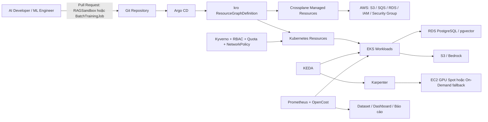

# ĐỀ CƯƠNG ĐỀ TÀI BÁO CÁO TỐT NGHIỆP — PHIÊN BẢN 3.0

TRƯỜNG ĐẠI HỌC THỦ DẦU MỘT  
VIỆN CÔNG NGHỆ SỐ  
CỘNG HÒA XÃ HỘI CHỦ NGHĨA VIỆT NAM  
Độc lập - Tự do - Hạnh phúc

TP.HCM, ngày 23 tháng 08 năm 2026

> **Trạng thái tài liệu:** `CANONICAL / SINGLE SOURCE OF TRUTH`  
> **Phiên bản:** `3.0`  
> **Phạm vi hiệu lực:** Đặc tả triển khai, thực nghiệm, nghiệm thu và viết báo cáo cho Zero D-Rift.  
> **Quan hệ với đề cương đã duyệt:** Giữ nguyên tên đề tài, mục tiêu và phạm vi cốt lõi của phiên bản 2; phiên bản 3 chỉ làm rõ kiến trúc, hạ tiêu chí về mức có thể kiểm chứng và loại bỏ các khẳng định chưa có dữ liệu.  
> **Quy tắc ưu tiên:** Khi tài liệu kỹ thuật khác trong repository mâu thuẫn với tài liệu này, phiên bản 3 được dùng để triển khai. Hồ sơ hành chính đã được nhà trường phê duyệt vẫn là căn cứ pháp lý cao nhất.

---

## 1. Thông tin sinh viên

- Họ và tên: Lê Văn Hoàng
- Mã số sinh viên: 2224802010279
- Lớp: D22CNTT02
- Khóa: 2022-2027
- Số điện thoại: 0399354603
- Giảng viên hướng dẫn: Nguyễn Trung Kiệt

## 2. Tên đề tài đăng ký

**Nghiên cứu và xây dựng nền tảng Internal Developer Platform hỗ trợ cấp phát và quản trị hạ tầng ứng dụng AI trên AWS.**

- Tên mã dự án: **Zero D-Rift**.
- Cách định vị sản phẩm: **Internal Developer Platform / Cloud Infrastructure Control Plane cho workload AI**.
- Không định vị sản phẩm là một nền tảng MLOps hoàn chỉnh vì đề tài không xây dựng toàn bộ vòng đời dữ liệu, huấn luyện, model registry, triển khai và giám sát mô hình.

## 3. Bối cảnh và bài toán nghiên cứu

Trong doanh nghiệp, kỹ sư AI/ML thường phụ thuộc vào đội vận hành để được cấp môi trường chạy ứng dụng, storage, database và tài nguyên tính toán. Quy trình thủ công có thể gây chậm trễ, cấu hình không đồng nhất, quyền truy cập quá rộng và tài nguyên thử nghiệm bị bỏ quên.

Zero D-Rift nghiên cứu khả năng dùng một control plane khai báo trên Kubernetes để cung cấp các golden path hạ tầng có kiểm soát. Người dùng cuối là **AI Developer / ML Engineer** gửi yêu cầu qua Pull Request chứa một Custom Resource YAML ngắn gọn. Nền tảng chịu trách nhiệm kiểm tra policy, tạo tài nguyên, công bố trạng thái và thu hồi workload theo quy tắc định trước.

Các con số như “3-5 ngày”, “12-15 bước”, “70% lỗi thủ công” chỉ được sử dụng trong báo cáo nếu có nguồn khảo sát hoặc dữ liệu doanh nghiệp. Trong thực nghiệm của đề tài, baseline chính thức là **quy trình tham chiếu thủ công do sinh viên định nghĩa, thực hiện và đo lại được**.

## 4. Mục tiêu nghiên cứu

### 4.1. Mục tiêu tổng quát

Xây dựng và đánh giá một PoC Internal Developer Platform trên AWS cho phép người dùng tự phục vụ hai mẫu hạ tầng AI đã chuẩn hóa, đồng thời hỗ trợ quản trị quyền, quan sát chi phí, thu hồi tài nguyên nhàn rỗi, phát hiện sai lệch cấu hình và thực hiện một quy trình phục hồi dữ liệu có kiểm soát.

### 4.2. Mục tiêu cụ thể

1. Thiết kế control plane dựa trên Kubernetes, Argo CD, kro và Crossplane.
2. Xây dựng hai golden path:
   - `RAGSandbox`: môi trường ứng dụng RAG dùng EKS Pod, S3 và RDS PostgreSQL/pgvector dùng chung.
   - `BatchTrainingJob`: workload huấn luyện theo lô, có khả năng yêu cầu GPU node động và lưu checkpoint vào S3.
3. Mô phỏng tối đa hai tenant bằng Namespace, RBAC, ResourceQuota, NetworkPolicy, Pod Security và IAM IRSA.
4. Đánh giá thời gian cấp phát, tỷ lệ thành công và mức giảm thao tác thủ công so với baseline tham chiếu.
5. Đánh giá chi phí compute của workload luôn bật so với workload dùng KEDA, Karpenter và Spot Instance trong cùng một workload profile.
6. Đánh giá độc lập hai cơ chế:
   - **Configuration remediation:** Crossplane đưa Security Group bị sửa ngoài luồng về trạng thái khai báo.
   - **Data recovery:** khôi phục một RDS PostgreSQL PoC từ manual snapshot, cập nhật thông tin kết nối và xác minh ứng dụng kết nối lại.
7. Ghi nhận đầy đủ giới hạn kỹ thuật, sai số đo, chi phí và các trường hợp không đạt giả thuyết.

### 4.3. Giả thuyết nghiên cứu

Các ngưỡng dưới đây là **mục tiêu cần kiểm chứng**, không phải kết quả đã đạt:

- **H1 — Provisioning:** `RAGSandbox` dùng RDS đã chuẩn bị trước đạt `p95 <= 5 phút` từ lúc Argo CD phát hiện commit hợp lệ đến khi ứng dụng vượt readiness check.
- **H2 — Batch readiness:** `BatchTrainingJob` đạt `p95 <= 15 phút` từ lúc yêu cầu được đồng bộ đến khi GPU workload bắt đầu chạy, bao gồm thời gian chờ EC2 capacity và node join cluster.
- **H3 — Reliability:** mỗi golden path đạt tỷ lệ cấp phát thành công `>= 90%` trên 20 lần thử.
- **H4 — Drift remediation:** Security Group trở về trạng thái khai báo với `p95 <= 120 giây` trên 20 lần thử.
- **H5 — Variable compute cost:** phương án KEDA + Karpenter + Spot giảm ít nhất `40%` chi phí compute biến đổi so với baseline On-Demand luôn bật trong workload profile cố định.
- **H6 — Data recovery:** ít nhất 4/5 lần restore thành công; RTO và RPO được báo cáo theo số đo thực tế, không đặt trước ngưỡng hai phút.

Việc một giả thuyết không đạt không làm mất giá trị nghiên cứu nếu hệ thống, dữ liệu và phân tích nguyên nhân có thể tái lập và được báo cáo trung thực.

## 5. Nội dung và phạm vi nghiên cứu

### 5.1. Nội dung nghiên cứu

- Khảo sát Platform Engineering, Internal Developer Platform, GitOps, FinOps và Kubernetes control-loop reconciliation.
- Thiết kế trải nghiệm self-service qua Git Pull Request và Custom Resource API.
- Phát triển hai ResourceGraphDefinition bằng kro; các graph tạo Kubernetes native resources và Crossplane managed resources.
- Cấp phát tài nguyên AWS qua Crossplane AWS provider, sử dụng quyền IAM tối thiểu.
- Tích hợp KEDA, Karpenter và OpenCost cho workload batch.
- Thiết lập governance bằng Kyverno, RBAC, ResourceQuota, NetworkPolicy, Pod Security và IRSA.
- Xây dựng test harness, thu raw event/log/metric và tạo dataset thực nghiệm.
- Xây dựng runbook triển khai, xử lý sự cố, phục hồi dữ liệu, kiểm soát chi phí và teardown.

### 5.2. Phạm vi MVP bắt buộc

- Một Amazon EKS cluster trong một AWS account sandbox và một AWS Region.
- Kubernetes mục tiêu: **Amazon EKS 1.35, AL2023**; phiên bản cuối cùng phải được pin trong version matrix sau compatibility spike.
- Tối đa hai tenant mô phỏng bằng Namespace. Đây là **logical/soft multi-tenancy cho PoC**, không tuyên bố hard isolation tương đương tài khoản AWS hoặc cluster riêng.
- Một RDS PostgreSQL/pgvector dùng chung cho RAG sandbox; mỗi sandbox dùng database/schema và credential riêng trong giới hạn PoC.
- Một RDS PostgreSQL PoC riêng hoặc bản clone dùng cho thí nghiệm data recovery để không phá hỏng môi trường RAG chính.
- Một batch training workload nhỏ, có thể hoàn thành trong thời gian ngắn và ghi checkpoint/artifact vào S3.
- GPU được dùng để chứng minh cơ chế provisioning và reclamation; đề tài không huấn luyện foundation model hoặc mô hình lớn.
- Phát triển local-first bằng `kind` hoặc `k3d`; tất cả chức năng phụ thuộc AWS, IRSA, EKS VPC CNI, Karpenter và RDS phải được xác nhận lại trên EKS thật.

### 5.3. Ngoài phạm vi

- Production-grade, multi-account, multi-region hoặc disaster recovery xuyên vùng.
- Xây dựng portal phức tạp như một sản phẩm Backstage hoàn chỉnh.
- Toàn bộ vòng đời MLOps, model registry, feature store, model serving platform hoặc model monitoring.
- Hard multi-tenancy chống hostile tenant ở mức kernel/cluster/account.
- Cam kết SLA/SLO cho môi trường production.
- Khôi phục dữ liệu production hoàn toàn tự động và không cần phê duyệt con người.
- So sánh để chứng minh Crossplane “tốt hơn tuyệt đối” Terraform. Terraform/OpenTofu được dùng cho bootstrap; Crossplane được đánh giá cho continuous reconciliation.

## 6. Kiến trúc chuẩn



### 6.1. Bootstrap plane

- Terraform/OpenTofu tạo VPC, EKS, OIDC provider, system node group, IAM nền tảng, logging cơ bản và budget controls.
- Bootstrap state được lưu an toàn; không đặt secret trong Git.
- EKS phải tồn tại trước khi Argo CD, Crossplane, kro và các controller được cài đặt.

### 6.2. Platform control plane

- Argo CD dùng Git làm nguồn desired state và đồng bộ platform/workload manifests.
- kro cung cấp API `RAGSandbox` và `BatchTrainingJob`, tính dependency graph và công bố readiness/status.
- Crossplane provider thực hiện API call đến AWS và reconcile external resources.
- Chỉ cài provider family/service packages thật sự cần dùng để tránh tải quá nhiều CRD lên API server.

### 6.3. Identity và secret flow

- Mỗi workload dùng một Kubernetes ServiceAccount riêng và một IAM role được scope theo cluster, namespace và service account.
- Pod không chứa long-lived AWS access key.
- Pod access đến EC2 Instance Metadata Service phải được hạn chế và kiểm thử.
- AWS Secrets Manager lưu thông tin kết nối cần thiết. Recovery job cập nhật endpoint/secret; ứng dụng phải có retry/reconnect logic.
- ExternalDNS chỉ dùng khi cần quản lý Route 53 record; không được mô tả là công cụ cập nhật Secrets Manager.

### 6.4. RAG Sandbox

- RDS instance không được tạo mới trong mỗi yêu cầu sandbox.
- RDS PostgreSQL/pgvector được chuẩn bị trước như shared platform service.
- Một yêu cầu `RAGSandbox` tạo namespace resources, app deployment, service account/IRSA binding, S3 bucket hoặc prefix, logical database/schema và secret reference.
- Một Kubernetes bootstrap Job có quyền giới hạn tạo logical database/schema và role riêng cho sandbox; administrative credential không được đưa cho workload người dùng.
- Readiness chỉ đạt khi app có thể kết nối database và thực hiện health check tối thiểu.

### 6.5. Batch Training Sandbox

- KEDA `ScaledJob` khởi chạy batch job theo số message trong một Amazon SQS queue dùng chung cho PoC.
- Pod request GPU và chỉ schedule vào Karpenter GPU NodePool.
- Karpenter ưu tiên Spot nhưng có On-Demand fallback cho thí nghiệm khi Spot không có capacity.
- Ứng dụng training tự checkpoint vào S3; Karpenter chỉ chịu trách nhiệm provision, drain và terminate node, không chịu trách nhiệm lưu trạng thái mô hình.

### 6.6. Configuration remediation và data recovery

- Thí nghiệm Security Group và RDS restore được chạy độc lập để đo đúng nguyên nhân và thời gian.
- Crossplane `deletionPolicy`/`managementPolicies` phải dùng đúng phiên bản đã pin. Không dùng giá trị không tồn tại như `DeletionPolicy: Retain`.
- Data recovery sử dụng manual snapshot hoặc retained backup đã xác minh trước khi phá hỏng DB PoC.
- Restore tạo DB instance mới hoặc tái tạo external resource theo runbook; chỉ đánh dấu thành công khi dữ liệu kiểm thử còn đúng và app kết nối lại.
- Kịch bản “phá hoại kép” chỉ dùng để trình diễn tuần tự sau khi hai test độc lập đã ổn định; không dùng làm dataset khoa học chính.

## 7. Công nghệ dự kiến

| Lớp | Công nghệ | Vai trò |
|---|---|---|
| Bootstrap IaC | Terraform hoặc OpenTofu | Tạo VPC, EKS, IAM nền tảng, budget và teardown |
| Cloud | AWS EKS, EC2, S3, SQS, RDS PostgreSQL/pgvector, Bedrock | Hạ tầng thực nghiệm và workload AI |
| GitOps | Argo CD | Đồng bộ desired state từ Git |
| Resource graph | kro — Kube Resource Orchestrator | Tạo API golden path và dependency graph |
| External provisioning | Crossplane + AWS provider packages | Provision/reconcile tài nguyên AWS |
| Pod autoscaling | KEDA | Scale-to-zero và tạo batch jobs theo event |
| Node provisioning | Karpenter | Tạo/thu hồi node, chọn Spot/On-Demand theo constraint |
| Cost observability | Prometheus + OpenCost | Thu utilization và phân bổ chi phí Kubernetes |
| Governance | Kyverno, RBAC, Pod Security, ResourceQuota, NetworkPolicy | Admission policy và giới hạn tenant |
| Identity | IAM IRSA | Temporary credential và least privilege theo ServiceAccount |
| Secret/DNS | AWS Secrets Manager, ExternalDNS khi cần | Secret storage và Route 53 record management |
| Test/Data | Pytest hoặc shell test harness, CSV/JSONL | Tự động thực nghiệm và lưu raw evidence |

Tất cả phiên bản, chart digest, image digest, AWS Region và cấu hình thí nghiệm phải được ghi trong `docs/VERSION_MATRIX.md` hoặc run manifest trước khi bắt đầu thu số liệu chính thức.

## 8. Baseline và phương pháp đo

### 8.1. Baseline tham chiếu

Baseline không giả định quy trình của một doanh nghiệp cụ thể. Sinh viên phải viết runbook thủ công có thể tái lập, gồm:

- Tạo namespace và quyền truy cập.
- Tạo hoặc cấu hình S3, database/schema, secret và app workload.
- Với batch training: provision GPU On-Demand, chạy workload, giữ node trong idle window cố định rồi thu hồi.
- Ghi số thao tác người dùng, số lệnh, thời gian chờ, lỗi và bước khắc phục.

Nếu có phỏng vấn chuyên gia hoặc dữ liệu từ doanh nghiệp, dữ liệu đó được báo cáo riêng và không trộn với baseline thực nghiệm.

### 8.2. Định nghĩa metric

| Metric | Điểm bắt đầu | Điểm kết thúc | Số lần tối thiểu |
|---|---|---|---:|
| RAG provisioning time | Argo CD ghi nhận revision chứa request hợp lệ | App readiness pass và truy vấn DB thành công | 20 |
| Batch readiness time | Argo CD ghi nhận request hợp lệ | GPU training container bắt đầu workload | 20 |
| Provisioning success rate | Một trial hợp lệ bắt đầu | Tất cả acceptance checks pass trong timeout | 20/blueprint |
| Manual interactions | Bắt đầu runbook/request | Môi trường usable | 5 baseline + log IDP |
| Drift detection time | AWS API xác nhận thay đổi trái phép | Controller ghi nhận drift | 20 |
| Drift remediation time | AWS API xác nhận thay đổi trái phép | Security Group trở về desired state | 20 |
| Scale-down time | Workload/event về 0 hoặc Job complete | Pod về 0 và GPU node terminate | 20 |
| Variable compute cost | Bắt đầu workload profile | Kết thúc workload và idle window | Tối thiểu 5 cặp |
| Data recovery RTO | Sự cố DB được xác nhận | App health và data-integrity check pass | 5 |
| Data recovery RPO | Thời điểm record cuối cùng còn trong snapshot | Thời điểm sự cố | 5 |
| Isolation/policy pass rate | Chạy negative test suite | Tất cả request trái phép bị chặn đúng kỳ vọng | Mỗi commit chính |

### 8.3. Quy tắc thu thập và báo cáo

- Đồng bộ thời gian bằng UTC trong raw log; giao diện báo cáo có thể chuyển sang UTC+7.
- Mỗi trial lưu: run ID, commit SHA, phiên bản component, Region/AZ, instance type, capacity type, thời điểm bắt đầu/kết thúc, trạng thái và lỗi.
- Không xóa trial thất bại. Trial bị loại phải có lý do loại trừ định trước.
- Báo cáo tối thiểu: `n`, success/total, min, max, median/p50, p95 và độ lệch chuẩn khi phù hợp.
- Với 20 trial, luôn công bố tỷ lệ dạng `x/20`; không chỉ ghi phần trăm.
- Raw dataset dùng CSV hoặc JSONL và phải có script sinh bảng/biểu đồ từ dữ liệu gốc.
- Không hard-code số đo vào report generator.

### 8.4. Công thức FinOps

```text
Variable Compute Saving Ratio
= (Baseline variable compute cost - Optimized variable compute cost)
  / Baseline variable compute cost
```

Phải báo cáo riêng:

1. GPU/EC2 variable compute cost.
2. Kubernetes cluster fixed cost.
3. RDS, storage, snapshot, public IPv4, NAT/VPC endpoint, logging và data-transfer cost.
4. Tổng chi phí PoC.

Không được suy luận “pod scale-to-zero” đồng nghĩa “toàn hệ thống không còn chi phí”. OpenCost dùng cho allocation/visibility; hóa đơn AWS/Cost Explorer hoặc Cost and Usage data là nguồn đối soát chi phí thực tế khi dữ liệu đã cập nhật.

## 9. Kịch bản thực nghiệm và demo

### 9.1. Self-service RAG

1. Người dùng tạo Pull Request chứa một `RAGSandbox` resource.
2. CI chạy schema, policy và static validation.
3. Sau khi merge, Argo CD đồng bộ request.
4. kro tạo graph; Crossplane/Kubernetes tạo tài nguyên.
5. Test xác minh namespace, S3 access, IRSA, DB connectivity và app readiness.

### 9.2. Batch training và FinOps

1. Tạo event/request cho `BatchTrainingJob`.
2. KEDA tạo Job; pod ở trạng thái pending vì cần GPU.
3. Karpenter tạo GPU node từ Spot hoặc fallback đã định nghĩa.
4. Job chạy, ghi checkpoint/artifact vào S3 và kết thúc.
5. Pod về 0, node được drain/terminate; OpenCost và AWS cost data ghi nhận chi phí.

### 9.3. Security Group drift

1. Dùng script có log thời gian để thêm một inbound rule ngoài desired state vào Security Group PoC.
2. Thu thời gian phát hiện và remediation.
3. Xác minh rule bị loại bỏ, rule hợp lệ vẫn còn và controller không tạo vòng lặp lỗi.

### 9.4. RDS data recovery

1. Ghi bộ dữ liệu kiểm thử có checksum và xác nhận manual snapshot/retained backup tồn tại.
2. Thực hiện sự cố được kiểm soát trên DB PoC, không dùng tài nguyên production.
3. Chạy recovery workflow theo runbook.
4. Cập nhật secret/endpoint nếu cần; app retry/reconnect.
5. Xác minh checksum, RTO, RPO và tài nguyên còn phát sinh chi phí.

### 9.5. Tenant isolation và governance

- Tenant A không đọc secret, service account hoặc Kubernetes object riêng của Tenant B.
- IAM role của Tenant A không truy cập S3 resource của Tenant B.
- Default-deny ingress/egress policy hoạt động trên EKS VPC CNI đã bật NetworkPolicy.
- Kyverno chặn workload thiếu resource requests/limits, image/tag policy hoặc metadata bắt buộc theo bộ policy đã công bố.
- Kyverno chỉ xác thực manifest/Custom Resource đi qua Kubernetes admission; không được tuyên bố nó tự kiểm soát mọi thay đổi trực tiếp trên AWS.

### 9.6. Teardown verification

Sau teardown phải kiểm tra tối thiểu: EKS, EC2/Spot, EBS, ELB, ENI, NAT Gateway, Elastic IP/public IPv4, RDS, snapshot, S3, Route 53, CloudWatch log group và Crossplane orphaned resources. Script phải idempotent và xuất inventory trước/sau.

## 10. Tiêu chuẩn nghiệm thu

### 10.1. Functional acceptance bắt buộc

- Hai Custom Resource API được tạo và có schema/status/readiness rõ ràng.
- Hai golden path chạy end-to-end trên EKS thật ít nhất một lần trước khi thu dataset chính thức.
- GitOps request có audit trail qua commit/PR và không yêu cầu người dùng cuối truy cập AWS Console.
- IRSA least-privilege và negative access tests hoạt động.
- Batch job có checkpoint/artifact trong S3 và GPU node được thu hồi sau khi hoàn tất.
- Security Group drift được phát hiện và sửa tự động.
- RDS recovery runbook khôi phục được dữ liệu kiểm thử và ứng dụng kết nối lại trong ít nhất 4/5 trial.
- Có dataset thô, script phân tích, dashboard, run manifest và danh sách trial thất bại.
- Teardown hoàn tất và inventory không còn tài nguyên ngoài danh sách retain có chủ đích.

### 10.2. Research acceptance bắt buộc

- Mọi kết quả được so với baseline đã định nghĩa trước.
- Giả thuyết đạt hay không đạt đều được báo cáo.
- Không dùng từ “100%”, “triệt tiêu hoàn toàn”, “quyền năng tuyệt đối”, “production-ready” hoặc “chuẩn doanh nghiệp” nếu không có tiêu chí và bằng chứng tương ứng.
- Không gọi mục tiêu nghiên cứu là kết quả thực nghiệm trước khi dataset được đóng băng.

## 11. Ngân sách và kiểm soát chi phí

Ngân sách trần của PoC là **100 USD credit/chi phí AWS**, nhưng đây là spending envelope, không phải bảo đảm của AWS Budgets.

| Nhóm | Spending envelope |
|---|---:|
| EKS control plane | 25 USD |
| System/CPU nodes | 25 USD |
| RDS, storage và snapshot | 15 USD |
| GPU trial | 15 USD |
| Network, IPv4, log và data transfer | 10 USD |
| Dự phòng | 10 USD |
| **Tổng** | **100 USD** |

Biện pháp bắt buộc:

- AWS Budget alerts tại 50%, 75% và 90%; cấu hình Budget Action phù hợp nếu account hỗ trợ.
- Kiểm tra Cost Explorer/Billing hằng ngày vì billing data có độ trễ.
- Giới hạn quota, instance family và tổng GPU vCPU; không cho Karpenter quyền mở rộng vô hạn.
- Tag tối thiểu: `Project=Zero-D-Rift`, `Owner=HoangLV`, `Environment=PoC`, `ExpiresAt=<timestamp>`.
- Ghi rõ lựa chọn NAT Gateway hoặc VPC endpoint trong cost plan; không bỏ chi phí mạng khỏi dự toán.
- EKS chỉ bật trong cửa sổ integration/experiment; local cluster dùng cho phần phát triển không phụ thuộc AWS.
- Chạy inventory và teardown ngay sau mỗi đợt thử nghiệm.
- Xác minh loại credit hiện có áp dụng cho EKS, EC2 GPU, RDS và các dịch vụ liên quan.

## 12. Lộ trình thực hiện đến tháng 11/2026

| Thời gian | Công việc | Exit criteria |
|---|---|---|
| 24-30/08 | Chốt kiến trúc, ADR, baseline, threat model, budget, quota và version matrix | Tài liệu và cost plan được review |
| 31/08-06/09 | Terraform/OpenTofu bootstrap EKS, CI validate và teardown | Tạo/xóa EKS tái lập được |
| 07-13/09 | Cài Argo CD, Crossplane, kro; spike S3 + Deployment | Một CR tạo resource graph thành công |
| 14-20/09 | Hoàn thành RAG Sandbox với shared RDS và IRSA | RAG end-to-end pass |
| 21-27/09 | RBAC, quota, NetworkPolicy, Pod Security, Kyverno | Negative test suite pass |
| 28/09-04/10 | KEDA ScaledJob, Karpenter và GPU NodePool | Batch end-to-end pass |
| 05-11/10 | Prometheus, OpenCost, baseline và cost instrumentation | Cost dashboard + raw metrics |
| 12-18/10 | Security Group remediation và RDS recovery | Hai kịch bản độc lập pass |
| 19-25/10 | Chạy trial chính thức và khóa dataset | Dataset, run manifests, analysis script |
| 26/10-01/11 | Đóng băng code, runbook, video, báo cáo và slide | Release candidate bảo vệ |
| Tháng 11 | Chỉ sửa lỗi, hoàn thiện báo cáo và luyện phản biện | Không thêm feature/technology mới |

### 12.1. Scope gates

- Nếu kro + Crossplane integration chưa tạo được S3 resource ổn định trước 13/09, dừng mở rộng và sửa vertical slice đầu tiên; không cài thêm công nghệ.
- Nếu chưa có RAG end-to-end trước 20/09, Batch Training không được mở rộng ngoài skeleton.
- Nếu GPU Spot không có capacity, dùng On-Demand cho trial chức năng và ghi rõ Spot là giới hạn thực nghiệm; không làm giả kết quả Spot.
- Nếu RDS recovery không thể tự động hóa an toàn, giữ recovery workflow có bước phê duyệt và báo đúng mức tự động hóa thực tế.
- Sau 18/10 không thêm portal, service mesh, multi-region, model registry hoặc công nghệ ngoài MVP.

## 13. Sản phẩm dự kiến bàn giao

1. Một quyển báo cáo mô tả bài toán, kiến trúc, triển khai, thực nghiệm, kết quả và giới hạn.
2. Repository có cấu trúc rõ ràng, gồm:
   - Bootstrap IaC.
   - Argo CD applications.
   - kro ResourceGraphDefinitions và example instances.
   - Crossplane provider/configuration/managed resources.
   - KEDA, Karpenter, Kyverno và OpenCost configuration.
   - Test harness, raw dataset và analysis scripts.
   - Teardown và resource-inventory scripts.
3. Một PoC trên Amazon EKS trình diễn ba nhóm giá trị:
   - Self-service provisioning.
   - FinOps auto-recycling cho batch workload.
   - Configuration remediation và data recovery có kiểm soát.
4. Hai golden path với input/output, status, timeout và lỗi được tài liệu hóa.
5. Bộ dữ liệu thực nghiệm không chỉnh sửa thủ công, kèm commit SHA và run manifest.
6. Architecture diagram, threat model, cost plan, deployment runbook, operation runbook và recovery runbook.
7. Video demo dự phòng và dashboard/log offline.

## 14. Rủi ro và phương án dự phòng

| Rủi ro | Ảnh hưởng | Phương án |
|---|---|---|
| AWS quota/GPU Spot thiếu capacity | Batch trial timeout | Đa dạng instance type/AZ; On-Demand fallback có giới hạn |
| Chi phí vượt dự toán | Không đủ credit | Local-first, spending envelope, budget action, TTL, teardown |
| RDS restore lâu | Không đạt demo trực tiếp | Báo RTO thật; video/log; không giữ mục tiêu 2 phút |
| Controller/version không tương thích | Control plane không ổn định | Compatibility spike, pin version/digest, không auto-upgrade |
| NetworkPolicy không được enforce | Tenant test sai | Bật EKS VPC CNI NetworkPolicy và chạy connectivity tests |
| Spot interruption làm mất training progress | Trial thất bại | App-level checkpoint S3 và retry; không gán trách nhiệm này cho Karpenter |
| GitOps/controller xóa nhầm tài nguyên | Mất dữ liệu/chi phí | Review PR, deletion protection, orphan policy, manual snapshot |
| Internet/AWS lỗi khi bảo vệ | Không live demo | Video Full HD, raw log, dashboard và local simulation |

## 15. Quản trị tuyên bố và thay đổi

### 15.1. Trạng thái của một tuyên bố

Mọi con số trong report/slide phải thuộc một trong bốn trạng thái:

- `ASSUMPTION`: giả định dùng để thiết kế.
- `TARGET`: ngưỡng mong muốn cần kiểm chứng.
- `OBSERVED`: số đo thô từ trial.
- `SUPPORTED`: kết luận được dataset và analysis script hỗ trợ.

Chỉ `SUPPORTED` được viết như kết quả cuối cùng. Ví dụ:

- Được phép trước thực nghiệm: “Mục tiêu p95 provisioning không quá 5 phút.”
- Không được phép trước thực nghiệm: “Zero D-Rift cấp phát hạ tầng trong dưới 5 phút.”
- Được phép sau thực nghiệm: “Trong 19/20 trial, median là X và p95 là Y theo dataset Z.”

### 15.2. Quy trình thay đổi SSOT

- Mọi thay đổi phạm vi, metric, timeout, số trial hoặc kiến trúc sau ngày bắt đầu thu dữ liệu phải có ADR/changelog ghi lý do.
- Không sửa metric sau khi xem kết quả để biến trial thất bại thành thành công.
- `docs/de_cuong_tot_nghiep_ver2.md`, `docs/drift.md`, `docs/drift2.md` và slide cũ được giữ làm lịch sử; không dùng làm đặc tả triển khai nếu mâu thuẫn với phiên bản 3.
- Khi hoàn tất dataset, tạo một Git tag cho phiên bản code, manifest và tài liệu đã dùng trong thực nghiệm.

## 16. Tài liệu tham chiếu chính thức

1. CNCF TAG App Delivery, *CNCF Platforms White Paper*: https://tag-app-delivery.cncf.io/whitepapers/platforms/
2. kro, *ResourceGraphDefinition*: https://kro.run/api/crds/resourcegraphdefinition/
3. Crossplane, *Managed Resources*: https://docs.crossplane.io/latest/managed-resources/managed-resources/
4. Argo CD Documentation: https://argo-cd.readthedocs.io/
5. AWS, *Amazon EKS Kubernetes versions*: https://docs.aws.amazon.com/eks/latest/userguide/kubernetes-versions.html
6. AWS, *IAM roles for service accounts*: https://docs.aws.amazon.com/eks/latest/userguide/iam-roles-for-service-accounts.html
7. Kubernetes, *Multi-tenancy*: https://kubernetes.io/docs/concepts/security/multi-tenancy/
8. KEDA, *Scaling Jobs*: https://keda.sh/docs/latest/concepts/scaling-jobs/
9. Karpenter, *Disruption*: https://karpenter.sh/docs/concepts/disruption/
10. OpenCost, *AWS configuration*: https://opencost.io/docs/configuration/aws/
11. AWS, *Restoring an RDS DB instance from a snapshot*: https://docs.aws.amazon.com/AmazonRDS/latest/UserGuide/USER_RestoreFromSnapshot.html
12. AWS, *Best practices for AWS Budgets*: https://docs.aws.amazon.com/cost-management/latest/userguide/budgets-best-practices.html
13. HashiCorp, *Manage resource drift*: https://developer.hashicorp.com/terraform/tutorials/state/resource-drift

---

**Kết luận phạm vi:** Zero D-Rift là một PoC IDP có hai golden path cho workload AI trên AWS. Giá trị của đề tài được chứng minh bằng khả năng tái lập, bằng chứng thực nghiệm và phân tích giới hạn; không bằng các cam kết tuyệt đối chưa được đo.
