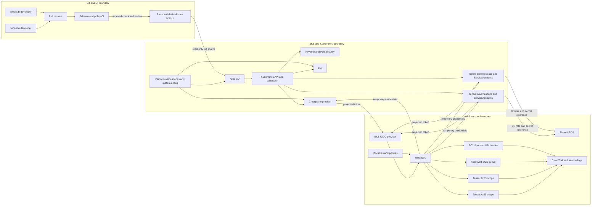

# Threat Model and Identity Design

## 1. Purpose, scope and evidence status

Tài liệu này định nghĩa security boundary cho Zero D-Rift trước khi P2 tạo EKS.
Nó trả lời bốn câu hỏi:

1. Tài sản nào cần bảo vệ?
2. Actor hoặc workload nào được phép làm gì?
3. Một quyền sai hoặc một manifest độc hại có thể vượt boundary ở đâu?
4. Negative test và evidence nào chứng minh control hoạt động?

Phạm vi giữ nguyên theo `docs/de_cuong_tot_nghiep_ver3.md`:

- một AWS account và một Region sandbox;
- một EKS cluster;
- tối đa hai tenant mô phỏng bằng namespace;
- hai golden path: `RAGSandbox` và `BatchTrainingJob`;
- IRSA cho temporary AWS credentials;
- shared RDS cho sandbox và RDS PoC/clone riêng cho recovery.

Task 4 chỉ tạo design evidence. Không có security control nào được tuyên bố đã
`PASS`, vì EKS, controller, IAM policy và workload chưa được triển khai.

| Status | Ý nghĩa trong tài liệu này |
| --- | --- |
| `DESIGN_REQUIRED` | Control bắt buộc theo canonical scope và phải được triển khai/test ở phase tương ứng. |
| `PLANNED` | Cách kiểm tra đã được thiết kế nhưng chưa có runtime evidence. |
| `UNVERIFIED` | Exact mechanism, permission hoặc account configuration chưa đủ evidence để chốt. |
| `RUNTIME_VERIFIED` | Control đã có command/run evidence của chính dự án. Task 4 chưa có mục nào đạt trạng thái này. |

## 2. Security objectives and non-goals

### 2.1. Objectives

- AI/ML developer yêu cầu golden path qua Git PR, không cần AWS Console hoặc
  Kubernetes administrator access.
- Mỗi controller và workload dùng identity riêng, quyền AWS/Kubernetes tối thiểu
  theo trách nhiệm.
- Tenant A không đọc hoặc sửa Kubernetes object, secret, database data hay AWS
  resource của Tenant B.
- Pod không chứa long-lived AWS access key; AWS SDK nhận temporary credentials
  từ IRSA.
- Manifest đặc quyền, thiếu guardrail hoặc vượt tenant boundary bị chặn trước khi
  trở thành running workload.
- Secret value không xuất hiện trong Git, log, screenshot, run manifest hoặc raw
  experiment data được commit.
- Administrative và recovery action có audit trail, approval boundary và blast
  radius giới hạn.
- Security claims chỉ được nâng lên `RUNTIME_VERIFIED` sau positive và negative tests.

### 2.2. Non-goals

- Không tuyên bố production-grade hoặc hostile-tenant hard isolation.
- Không thêm multi-account, multi-cluster, service mesh, SIEM, PKI riêng hoặc
  third-party secret controller trong P1.
- Không chốt exact IAM actions/ARN, secret-integration controller, EKS endpoint
  exposure hoặc KMS design khi chưa có account/Region evidence.
- Không coi Kyverno là control cho thay đổi trực tiếp trên AWS.
- Không coi NetworkPolicy là mã hóa traffic hoặc firewall cho mọi protocol.

## 3. Protected assets and data classification

| Asset | Why it matters | Classification | Primary owner |
| --- | --- | --- | --- |
| Git default branch, PR history and manifests | Desired state và audit trail của platform/golden paths | Integrity-critical | Repository owner/platform admin |
| CI result and policy report | Quyết định manifest có đủ điều kiện merge hay không | Integrity-critical | CI workflow/repository owner |
| Terraform/OpenTofu state | Có thể chứa resource identifiers và sensitive outputs; quyết định bootstrap ownership | Restricted | Bootstrap operator |
| EKS API and cluster-scoped objects | Điều khiển controller, admission, RBAC và workload toàn cluster | Highly privileged | Platform admin |
| Kubernetes Secrets and ServiceAccount tokens | Có thể cho phép truy cập data/Kubernetes/AWS | Secret | Namespace/platform owner |
| IAM roles, trust policies and temporary credentials | Quyết định AWS API nào principal được gọi | Secret or highly privileged metadata | AWS/platform admin |
| Crossplane ProviderConfig and provider runtime | Có thể provision/reconcile external AWS resources | Highly privileged | Platform controller owner |
| Tenant S3 data, checkpoints and artifacts | Dữ liệu/application state của từng tenant/workload | Tenant-confidential | Tenant workload/platform |
| Shared RDS data and DB credentials | Dữ liệu RAG của cả hai sandbox trên shared instance | Tenant-confidential / Secret | Database/platform owner |
| Recovery RDS snapshot/clone | Có bản sao dữ liệu và destructive workflow | Restricted | Recovery operator |
| SQS messages | Có thể kích hoạt batch workload và chứa workload metadata | Tenant/workload-confidential | Batch platform owner |
| Node IAM role, EC2/Spot/GPU capacity | Compromise có thể mở rộng blast radius hoặc gây chi phí | Highly privileged | Bootstrap/Karpenter owner |
| Evidence, logs and run manifests | Dùng để bảo vệ luận văn nhưng có thể rò secret/account data | Internal after redaction | Experiment owner |

## 4. Actors and trust assumptions

| Actor | Intended access | Trust assumption | Must not receive |
| --- | --- | --- | --- |
| Tenant A/B developer | Tạo branch/PR cho custom resource của tenant được cấp | Semi-trusted; manifest có thể sai hoặc vượt quyền | AWS Console credential, kubeconfig, cluster-admin, secret tenant khác |
| Repository reviewer/platform owner | Review và merge thay đổi platform/request | Trusted for approval but vẫn cần protected-branch audit | Quyền bypass không có log hoặc long-lived shared credential |
| CI runner | Đọc checkout và chạy schema/static/policy tests | Code/PR input là untrusted | AWS credential, production kubeconfig, secret value |
| Terraform/bootstrap principal | Tạo VPC/EKS/OIDC/system nodes/bootstrap IAM | Highly trusted, time-bounded administrative role | Tenant application credential hoặc permanent user key |
| Human cluster administrator | Điều tra và vận hành cluster | Highly trusted; dùng temporary session | Daily unrestricted `system:masters` identity |
| Argo CD | Đọc approved Git revision và apply approved Kubernetes scope | Trusted controller; Git content chỉ trusted sau merge gates | AWS provisioning role |
| kro | Tạo/reconcile dependency graph từ approved custom resources | Trusted controller with bounded Kubernetes RBAC | AWS credential hoặc cluster-admin nếu không cần |
| Crossplane AWS provider | Reconcile selected S3/EC2 resource classes | Highly privileged platform workload | Bootstrap EKS/VPC/RDS/IAM permissions ngoài allowlist |
| Kyverno | Validate admission requests và report policy violations | Trusted admission controller | AWS credential |
| KEDA | Quan sát approved SQS queue và tạo Job qua Kubernetes | Trusted autoscaling controller | S3/RDS/admin permission không liên quan |
| Karpenter | Tạo/thu hồi EC2 nodes theo NodePool/NodeClass | Privileged AWS controller | Quyền sửa arbitrary IAM/VPC/EKS resources ngoài node lifecycle |
| Tenant application/batch Pod | Chạy app hoặc training, truy cập đúng data scope | Workload có thể bị compromise | Node role, provider role, tenant khác, DB admin credential |
| Database bootstrap Job | Chuẩn bị đúng DB/schema/role trong thời gian giới hạn | Privileged hơn app nhưng bounded | AWS admin hoặc quyền sửa database/schema tenant khác |
| External attacker/compromised dependency | Không có intended access | Untrusted | Mọi credential, write path và confidential data |

## 5. Trust-boundary overview



Trust boundaries cần chú ý:

1. Untrusted PR input sang protected desired-state branch.
2. Git desired state sang Kubernetes API qua Argo CD.
3. Namespace-scoped tenant object sang cluster-scoped controller/resource.
4. Kubernetes ServiceAccount token sang AWS STS/IAM.
5. Shared EKS node/control plane giữa platform và hai tenant.
6. Shared RDS instance giữa hai logical tenant data scopes.
7. Raw runtime output sang redacted thesis evidence.

## 6. Identity flows

### 6.1. Git and CI flow

1. Developer chỉ gửi golden-path request qua branch/PR.
2. CI chạy schema, static và policy validation trên input được coi là untrusted.
3. CI không cần AWS credential hoặc EKS kubeconfig cho P1/P2 manifest validation.
4. Merge chỉ được phép sau required status checks và review theo branch-protection
   rule; trạng thái cấu hình thực tế hiện `UNVERIFIED`.
5. Argo CD dùng read-only Git credential/deploy key hoặc GitHub App permission
   tối thiểu để đọc approved revision. Exact credential method `UNVERIFIED`.
6. Argo CD chỉ apply repository path, destination cluster và namespace được
   allowlist trong AppProject/application design; exact RBAC chưa được triển khai.

Threat chính là PR độc hại, CI secret exfiltration, bypass review, mutable artifact
và Argo CD có destination/resource scope quá rộng.

### 6.2. Human administrative flow

```text
Human sign-in/federation
  -> short-lived AWS role session
  -> EKS access entry
  -> namespace-scoped EKS access policy or Kubernetes RBAC
  -> Kubernetes API
```

- Không dùng IAM user access key dài hạn cho daily administration.
- Bootstrap principal và workload role là hai identity khác nhau.
- Developer bình thường không có direct Kubernetes hoặc AWS access.
- Daily operator dùng quyền thấp nhất; cluster-wide admin chỉ cho bootstrap hoặc
  break-glass action có audit trail.
- Exact federation source, EKS access policy, break-glass procedure và cluster
  endpoint exposure vẫn `UNVERIFIED` cho P2.

### 6.3. IRSA workload flow

```text
Pod
  -> dedicated Kubernetes ServiceAccount
  -> projected OIDC service-account token
  -> IAM trust policy checks exact issuer + aud + sub
  -> sts:AssumeRoleWithWebIdentity
  -> temporary role credentials
  -> allowed AWS API/resource only
```

Required design rules:

- Mỗi application/controller có ServiceAccount riêng; không tái sử dụng default
  ServiceAccount cho workload có AWS access.
- IAM trust policy bind `aud=sts.amazonaws.com` và exact
  `sub=system:serviceaccount:<namespace>:<service-account>`; không dùng subject
  wildcard cho cả tenant namespace nếu không có evidence bắt buộc.
- IAM permission policy giới hạn actions và resource ARN/prefix/queue cụ thể.
- `automountServiceAccountToken: false` cho Pod không gọi Kubernetes API/IRSA;
  Pod cần IRSA chỉ mount token ở identity đã định nghĩa.
- Chặn workload truy cập EC2 Instance Metadata Service để tránh fallback sang
  node role; `hostNetwork` không được tenant workload sử dụng.
- CloudTrail/STS evidence phải chứng minh assumed role đúng; không ghi token hoặc
  temporary credential vào evidence.

Exact IAM actions, ARN, SDK versions và node IMDS configuration vẫn `UNVERIFIED`
đến P2/P3 implementation.

### 6.4. Controller and workload identity matrix

| Principal / ServiceAccount | Kubernetes permission boundary | AWS permission boundary | Explicit deny intention |
| --- | --- | --- | --- |
| Argo CD application controller | Apply/get/watch only approved kinds, paths and destinations | None for provisioning | Không tạo AWS resource trực tiếp; không apply ngoài approved projects/namespaces |
| kro controller | Watch golden-path CRs; create/update graph-owned children | None | Không gọi AWS API; không sửa object không thuộc graph |
| Crossplane provider | Provider runtime/managed-resource operations trong platform scope | Chỉ selected S3 và EC2/SG APIs sau allowlist | Deny EKS/VPC bootstrap, IAM admin, shared RDS và unselected services |
| Kyverno | Admission/policy/report resources cần thiết | None | Không đọc tenant secret values hoặc gọi AWS API |
| KEDA controller/scaler identity | ScaledJob/Job/HPA-related resources cần thiết | Chỉ đọc approved SQS queue attributes/messages theo design | Không truy cập S3/RDS hoặc queue ngoài allowlist |
| Karpenter controller | NodePool/NodeClass/Node lifecycle resources | EC2/node provisioning APIs và bounded `iam:PassRole` khi được duyệt | Không sửa arbitrary IAM policy, tenant S3/RDS hoặc bootstrap EKS/VPC |
| `tenant-a` RAG ServiceAccount | Chỉ object cần thiết trong namespace A; thường không cần Kubernetes API | Tenant A S3/Bedrock/secret scope được duyệt | Tenant B, admin AWS APIs, node/provider role |
| `tenant-b` RAG ServiceAccount | Chỉ object cần thiết trong namespace B; thường không cần Kubernetes API | Tenant B S3/Bedrock/secret scope được duyệt | Tenant A, admin AWS APIs, node/provider role |
| Database bootstrap Job ServiceAccount | Chỉ Job/config/secret reference cần cho sandbox | Đọc đúng bootstrap secret nếu integration cần | Secret tenant khác và AWS admin; PostgreSQL admin quyền không đến từ IAM |
| Batch training ServiceAccount | Job/Pod status cần thiết; không có cluster-wide write | Approved checkpoint S3 prefix và SQS path nếu workload cần | Tenant khác, RDS admin, Karpenter controller role |
| System-node instance role | Node join/pull/network functions tối thiểu | Chỉ node-level AWS APIs | Không trở thành fallback credential cho tenant Pod |

Đây là permission boundary design, không phải exact IAM policy. Exact actions và
resource ARN chỉ được pin khi resource names, Region và provider APIs đã chốt.

### 6.5. Database and secret flow

1. Secret source of truth là AWS Secrets Manager theo canonical scope.
2. Exact integration để Pod nhận secret vẫn `UNVERIFIED`; không tự chọn External
   Secrets Operator hoặc Secrets Store CSI trong Task 4.
3. IRSA/IAM chỉ cho phép đọc secret object được chỉ định.
4. PostgreSQL role/GRANT quyết định quyền tạo schema, đọc bảng và truy cập data.
5. Application dùng per-sandbox DB role; không nhận bootstrap/admin credential.
6. Recovery dùng secret/endpoint riêng cho DB PoC/clone và không ghi đè shared
   RDS connection nếu chưa có approval/evidence.

Đọc secret thành công không chứng minh PostgreSQL authorization thành công.

## 7. Soft multi-tenancy controls and limitations

### 7.1. Required controls per tenant namespace

- Namespace riêng với trusted tenant labels do platform quản lý.
- Role/RoleBinding thay vì tenant ClusterRoleBinding; không wildcard verbs/resources.
- ServiceAccount riêng cho từng workload; default ServiceAccount không tự mount token.
- ResourceQuota và LimitRange để giới hạn Pod/object/CPU/memory và yêu cầu resource
  requests/limits.
- Default-deny ingress và egress NetworkPolicy, sau đó allow DNS, shared RDS và
  approved endpoints/namespace flows tối thiểu.
- EKS VPC CNI NetworkPolicy feature phải được bật và runtime-tested; tạo YAML
  NetworkPolicy khi CNI không enforce không tạo isolation.
- Pod Security `restricted` cho tenant workload; exception chỉ qua review và
  không mặc định áp dụng cho platform-system namespaces.
- Kyverno `Enforce` cho guardrail đã test: required tenant/owner labels, resource
  requests/limits, cấm privileged/host namespace/hostPath và mutable image policy
  theo implementation spec. Audit trước khi Enforce nếu policy có nguy cơ chặn
  controller cần thiết.
- Tenant developer không được tạo trực tiếp Provider, ProviderConfig,
  DeploymentRuntimeConfig, ClusterRole/Binding, Namespace hoặc cluster-scoped policy.

### 7.2. Why this remains soft isolation

Namespace, RBAC, quota, NetworkPolicy, Pod Security và IAM role làm giảm blast
radius nhưng không biến PoC thành hard multi-tenancy vì:

- hai tenant dùng chung EKS control plane, nodes, CNI và cluster-scoped controllers;
- namespace không cô lập CRD, webhook, StorageClass, node hoặc ClusterRole;
- quyền tạo workload trong namespace có thể gián tiếp truy cập ServiceAccount và
  mounted secret trong namespace đó nếu RBAC/admission thiết kế sai;
- NetworkPolicy phụ thuộc VPC CNI enforcement và chủ yếu kiểm soát L3/L4, không
  phải mã hóa hay complete node/host isolation;
- shared RDS vẫn có instance-level failure domain và noisy-neighbor risk;
- cả hai tenant ở cùng AWS account/VPC; IAM hoặc resource-policy sai có thể làm
  mất AWS-side isolation;
- cluster admin, node compromise hoặc privileged platform controller có thể vượt
  namespace boundary.

Vì vậy kết luận hợp lệ chỉ là: **soft isolation phù hợp PoC hai tenant mô phỏng và
được kiểm chứng bằng negative tests**. Không được gọi là hostile-tenant hoặc
production-grade isolation.

## 8. Threat-to-control-to-test mapping

Tất cả test dưới đây là `PLANNED`. Task implementation phải lưu command, timestamp,
commit SHA, observed result và redacted output; Task 6 sẽ chốt run-manifest schema
và evidence storage convention.

| ID | Threat / abuse case | Preventive or detective controls | Negative/positive test intention | Required evidence |
| --- | --- | --- | --- | --- |
| T01 | Developer push trực tiếp hoặc merge manifest chưa review/check | Protected branch, required review/check, no bypass by default | User thường thử direct push/merge khi check fail và phải bị từ chối | Repository rule export/screenshot đã redact, failed check, PR audit trail |
| T02 | Malicious PR exfiltrate CI/AWS/Kubernetes credentials | CI không có AWS/kube credential; least Git token; untrusted input | CI job kiểm tra không có AWS env/kubeconfig; invalid manifest fail mà không gọi AWS | Workflow permission diff, redacted job log, exit code |
| T03 | Argo CD apply resource/kind/namespace ngoài golden-path scope | Read-only Git credential, AppProject source/destination/resource allowlist, RBAC | Manifest nhắm namespace/cluster-scoped kind ngoài allowlist bị reject/sync fail | Argo condition/event, Kubernetes absence check |
| T04 | Tenant A đọc/sửa object hoặc Secret của Tenant B | Namespace Role/RoleBinding, no wildcard/list-all secrets, separate ServiceAccounts | `kubectl auth can-i` và API attempt từ A đối với Secret/Deployment B trả `no/Forbidden` | Sanitized auth matrix and API error |
| T05 | Tenant tạo privileged Pod để mount secret/token hoặc chiếm node | Pod Security restricted, Kyverno, bounded workload-create permission | Privileged, `hostNetwork`, `hostPath`, root/escalation manifest bị admission reject | Admission error, Kyverno event/policy report |
| T06 | Compromised Pod lấy node-role credential qua IMDS | IRSA, dedicated SA, IMDS restriction, no tenant `hostNetwork` | Tenant Pod không reach metadata credential endpoint; AWS SDK caller là workload role | Redacted connectivity result and STS caller role alias |
| T07 | IRSA trust policy quá rộng cho namespace/ServiceAccount khác | Exact OIDC issuer, `aud`, `sub`; one role per application | ServiceAccount khác thử assume role và nhận `AccessDenied`; intended SA thành công | Redacted trust policy, CloudTrail/STS event, caller identity alias |
| T08 | Tenant A truy cập S3/secret/SQS của Tenant B | Resource-scoped IAM policy, bucket/queue/secret resource policy when needed | Positive own-resource request pass; cross-tenant request `AccessDenied` | AWS CLI/SDK result without object/secret content, CloudTrail event |
| T09 | Tenant hoặc compromised graph dùng Crossplane để tạo arbitrary AWS resource | Restrict direct managed-resource/Provider creation; provider IAM allowlist; ownership review | Tenant cannot create Provider/ProviderConfig/unapproved managed kind; provider role denied unselected API | Kubernetes `Forbidden`, AWS `AccessDenied`, provider event |
| T10 | Pod đi ngang giữa tenant hoặc egress tùy ý | VPC CNI NetworkPolicy enabled, strict startup/default deny, explicit DNS/RDS/AWS allows | A-to-B connection fail; allowed DNS/RDS path succeeds; no-policy control proves enforcement | Pod connectivity matrix, CNI/PolicyEndpoint status, timestamps |
| T11 | Tenant gây resource exhaustion/noisy neighbor | ResourceQuota, LimitRange, required requests/limits, bounded Karpenter limits | Over-quota Pod/object rejected; within-quota workload admitted | Quota status, admission error, node/capacity observation |
| T12 | Secret/token/account data rò vào Git, log, screenshot or dataset | External secret source, RBAC, source redaction, evidence allowlist, pre-commit/static scan | Synthetic marker secret is detected/redacted; repository search finds no real secret patterns | Scanner/search command and redacted result; no secret value retained |
| T13 | RAG app hoặc Tenant A đọc data/schema của Tenant B | Per-sandbox DB/schema/role, no admin credential in app, PostgreSQL GRANTs | A can read own sentinel row but cross-schema/table query fails; app cannot `CREATE ROLE` | SQL exit/status and sanitized role/schema aliases; never DB password |
| T14 | Mutable/untrusted image or manifest bypasses intended artifact | Pin version/digest before trials; Kyverno image/tag policy; PR review | `latest`/disallowed registry or missing digest according to final policy is rejected | Policy result and resolved image digest |
| T15 | Kyverno/webhook failure silently allows unsafe workload | Reviewed failurePolicy, policy health monitoring, staged Audit-to-Enforce rollout | Known-bad manifest rejected in healthy state; webhook outage behavior observed before production claim | Webhook config, event, policy report and controlled failure result |
| T16 | Daily admin or automation has cluster-admin/system:masters unnecessarily | Short-lived AWS role, EKS access entry, namespace scope, separate break-glass | Daily role cannot perform selected cluster-wide mutation; break-glass action is logged | Access entry/RBAC export, `can-i` matrix, CloudTrail/Kubernetes audit reference |
| T17 | Recovery or deletion action destroys shared RDS/data | Separate recovery DB/clone, approval gate, snapshot check, distinct secret/endpoint | Recovery command refuses shared endpoint/resource alias; checksum/reconnect only on recovery target | Approval record, inventory, snapshot metadata, sanitized checksum result |
| T18 | Evidence is edited, incomplete or contains secrets | Run ID, commit SHA, timestamps, raw immutable input, redacted derivative, failed trials retained | Recompute summary from raw data; secret scan passes; excluded trial keeps reason | Run manifest, hashes, raw file, analysis output, exclusion record |

## 9. Secret and evidence redaction policy

### 9.1. Never store or display

- AWS access key ID, secret access key, session token or web-identity JWT.
- GitHub PAT, deploy-key private key, webhook secret or CI token.
- kubeconfig client key/token/certificate private material.
- database password, complete connection URI, bootstrap/admin credential.
- Kubernetes Secret `data`/`stringData` value, even when base64 encoded.
- AWS account ID, private personal identifiers or unredacted secret ARN.
- Terraform state/plan output containing sensitive values.

Base64 is encoding, not encryption. A base64 Kubernetes Secret value remains secret.

### 9.2. Allowed evidence metadata

- run ID, UTC/local timestamp, commit SHA and component version/digest;
- logical aliases such as `tenant-a-bucket`, not real account-qualified identifiers;
- Kubernetes kind/namespace/object name when it does not reveal private data;
- condition type/status/reason, HTTP/AWS error class and exit code;
- sanitized IAM role alias and allowed/denied action name;
- checksum/hash of a known test payload, not the payload or credential;
- cost/allocation identifiers only after account/resource identifiers are redacted.

### 9.3. Collection procedure

1. Prefer commands that select metadata fields instead of dumping whole objects.
2. Never run broad output such as all Secrets, full environment or full Terraform
   state merely to obtain evidence.
3. Redirect sensitive-capable output only to an approved non-Git temporary location;
   create a separate redacted evidence copy.
4. Replace account IDs, ARNs, endpoints, usernames and token-like values with
   stable aliases so events can still be correlated.
5. Inspect terminal output and screenshots before saving; crop unrelated windows.
6. Run repository secret-pattern checks before commit. Store the command and pass/
   fail result, never the discovered secret value.
7. Nếu secret từng xuất hiện trong output/Git, dừng publication, revoke/rotate qua
   owner-approved procedure và ghi incident metadata đã redact.

Exact scanner/tooling được chọn trong implementation/CI task; Task 4 không thêm
một security product mới.

## 10. Security evidence sources

| Boundary | Primary evidence | What it can prove | What it cannot prove alone |
| --- | --- | --- | --- |
| Git/CI | PR history, protected-branch settings, check logs | Review/check gates executed for a revision | Runtime workload or AWS authorization |
| Kubernetes API | RBAC `can-i`, admission errors, events, object absence/presence | Kubernetes authorization and admission result | AWS IAM permission or network enforcement alone |
| Kyverno | Policy/ClusterPolicy, events, PolicyReports | Rule evaluation/reporting for admitted/scanned Kubernetes resources | Direct AWS Console/API changes |
| Network | Connectivity matrix plus VPC CNI policy status | Selected flows allowed/denied while CNI enforcement is active | Encryption, node compromise or all protocols |
| IRSA/IAM | Trust/permission policy metadata, STS caller alias, CloudTrail | Which role was assumed and whether AWS API allowed/denied | PostgreSQL authorization |
| S3/SQS/RDS | Sanitized API/SQL outcomes and service audit logs | Data/service authorization for test action | All future actions or hard tenant isolation |
| Experiment bundle | Run manifest, raw output, hashes, analysis | Reproducible observed result for pinned revision/config | Claims outside the trial boundary |

## 11. Open decisions and residual risks

| Item | Status | Required decision/evidence |
| --- | --- | --- |
| Git branch protection and CI token permissions | `UNVERIFIED` | Inspect actual repository settings and workflow permissions before GitOps implementation. |
| Human AWS federation and EKS access-entry policy | `UNVERIFIED` | Choose existing account sign-in mechanism and define daily/break-glass roles in P2. |
| EKS API endpoint public/private access | `UNVERIFIED` | Decide with network/cost plan; document allowed CIDRs/connectivity. |
| Exact IRSA IAM actions and resource ARNs | `UNVERIFIED` | Generate from selected resources/provider API calls; run positive and negative L3 tests. |
| IMDS restriction and node launch-template settings | `UNVERIFIED` | Verify AL2023/Karpenter node behavior on EKS. |
| VPC CNI version, NetworkPolicy enablement and strict mode | `UNVERIFIED` | Pin add-on/config and run EKS connectivity matrix. |
| Secret integration from Secrets Manager | `UNVERIFIED` | Compare direct SDK, CSI or external-sync trade-offs without adding technology silently. |
| Kubernetes secret encryption/KMS configuration | `UNVERIFIED` | Decide after EKS/bootstrap and cost review. |
| Crossplane provider exact allowlist and lifecycle policy | `UNVERIFIED` | Complete L2 pairing, ownership and deletion/management-policy review. |
| Karpenter controller/node-role IAM boundary | `UNVERIFIED` | Pin version-specific permissions and bounded `iam:PassRole` during P6. |
| Kyverno failure policy and exception process | `UNVERIFIED` | Test required policies in Audit then Enforce; define who may approve exceptions. |
| RDS database/schema privilege statements | `UNVERIFIED` | Implement per-sandbox roles and cross-tenant SQL negative tests. |
| Evidence storage path and run-manifest schema | `APPROVED_CONTRACT` | Task 6 contract v0.1.0 defines the planned immutable raw-data layout, manifest fields and redacted publication boundary; later harness/runtime enforcement remains unverified. |

Residual risk remains even after controls: a compromised cluster admin, node kernel,
platform controller or shared database admin can cross tenant boundaries. This is
accepted only inside the stated PoC soft-isolation scope, not as a production claim.

## 12. Implementation gates

### Before P2 EKS bootstrap

- Decide human/bootstrap AWS principal and temporary-session method.
- Decide EKS access-entry/admin boundary and API endpoint exposure.
- Define Terraform state protection; do not print/store sensitive output in Git.
- Pin EKS/VPC CNI settings needed for later NetworkPolicy enforcement.

### Before P3 controller installation

- Define Argo CD source/destination/resource allowlists.
- Complete Crossplane provider package and AWS IAM allowlist review.
- Ensure controller ServiceAccounts are distinct and default tokens are not reused.
- Pin chart/image/package digests and preserve install evidence.

### Before tenant/golden-path acceptance

- Apply RBAC, ResourceQuota/LimitRange, Pod Security and NetworkPolicy controls.
- Run T04-T13 positive/negative tests on EKS.
- Confirm app Pod never receives DB admin or node/provider AWS credentials.
- Record why namespace tenancy remains soft isolation.

### Before official trials/publication

- Freeze security-test inputs and run-manifest schema.
- Run redaction/secret checks and retain failed trials with reasons.
- Do not publish real account identifiers, credentials or sensitive state.
- Re-run access tests after IAM/RBAC/policy changes; an old PASS is not transferable.

## 13. Official references checked 2026-09-28

- AWS EKS, [IAM roles for service accounts](https://docs.aws.amazon.com/eks/latest/userguide/iam-roles-for-service-accounts.html)
- AWS EKS, [Assign IAM roles to Kubernetes service accounts](https://docs.aws.amazon.com/eks/latest/userguide/associate-service-account-role.html)
- AWS EKS Best Practices, [Identity and Access Management](https://docs.aws.amazon.com/eks/latest/best-practices/identity-and-access-management.html)
- AWS EKS, [Create access entries](https://docs.aws.amazon.com/eks/latest/userguide/creating-access-entries.html)
- AWS EKS, [Restrict Pod network traffic with Kubernetes network policies](https://docs.aws.amazon.com/eks/latest/userguide/cni-network-policy-configure.html)
- Kubernetes, [Multi-tenancy](https://kubernetes.io/docs/concepts/security/multi-tenancy/)
- Kubernetes, [RBAC good practices](https://kubernetes.io/docs/concepts/security/rbac-good-practices/)
- Kubernetes, [Network Policies](https://kubernetes.io/docs/concepts/services-networking/network-policies/)
- Kubernetes, [Pod Security Standards](https://kubernetes.io/docs/concepts/security/pod-security-standards/)
- Kubernetes, [Good practices for Secrets](https://kubernetes.io/docs/concepts/security/secrets-good-practices/)
- Kubernetes, [Resource Quotas](https://kubernetes.io/docs/concepts/policy/resource-quotas/)
- Kyverno, [Introduction and capabilities](https://kyverno.io/docs/introduction/)
- Kyverno, [Validate rules](https://kyverno.io/docs/policy-types/cluster-policy/validate/)
- GitHub, [Managing protected branches](https://docs.github.com/en/repositories/configuring-branches-and-merges-in-your-repository/managing-protected-branches)
